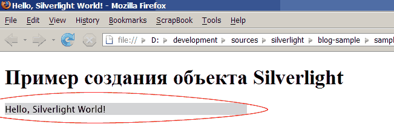

Фокус на Silverlight
====================

        published: 2007-09-09 
        tags: .net,flash,silverlight 
        permalink: https://andir-notes.blogspot.com/2007/09/silverlight.html

На этой неделе (неожиданно для меня) состоялся релиз продукта Microsoft Silverlight 1.0. Решил немного поглядеть на его содержимое.

_Примечание: Эта статья про первую версию Silverlight и в данный момент уже устарела. Но я сделал обзор и_ [_второй части_](http://andir-notes.blogspot.com/2009/02/silverlight-2.html "Andir: Фокус на Silverlight 2")_._

Что мне понадобилось для препарирования: [Silverlight 1.0](http://go.microsoft.com/fwlink/?LinkID=88632&clcid=0x409), [Silverlight SDK 1.0](http://www.microsoft.com/downloads/details.aspx?FamilyId=FB7900DB-4380-4B0F-BB95-0BAEC714EE17&displaylang=en), [Expression Blend 2 August Preview](http://www.microsoft.com/downloads/details.aspx?familyid=69540337-B619-4A47-AC27-52D8AF3A7830&displaylang=en) (графический редактор, который позволяет создавать и проекты Silverlight).

Установка проходит быстро и безболезненно, единственный момент, что юзабилити окна окончания установки желает лучшего:  


Кусочек льда(?) на сплеше-подобном окне, конечно, выглядит красиво, но мало того, что браузер надо рестартовать самому, так и совершенно неясно, что же делать дальше - приходится прерывать свой ступор и закрывать окно крестиком сверху.

Поехали дальше.

Без неожиданностей в нашей работе (конечно же речь о программистах) обычно не обойтись, так и в этот раз. В Firefox плагин Silverlight конечно же сразу не заработал: первым делом, я попытался открыть QuickStart, а там во всех местах, где должен был появится Silverlight - мне предлагалось его скачать "Get Silverlight Now!". Подозрение в подпольной подрывной деятельности пало, естественно, на расширения с блокирующим функционалом: и после отключения AdBlock и FlashBlock - Silverlight всё таки заработал (виноват в конечном итоге оказался FlashBlock, который очень любит блокировать тэг <object>).

Замечание: В Mozilla Firefox проигрыватель Silverlight устанавливается именно как плагин (plug-in), а не расширение (extension, или add-on) - это можно увидеть в окне about:plugins.

Теперь кратко о том, что же такое Silverlight: по старому названию **wpf/e** (где буква **e** - это everywhere) можно сразу понять было, что внутри, наверняка, можно увидеть XAML (для тех кто знаком с WPF конечно, одной из ключевых технологий .Net Framework 3.0). Собственно со сменой названия, суть продукта не сменилась - это всё также - проигрыватель XAML-файлов, реализованный в виде расширений к известным браузерам (на текущий момент это IE, Firefox и Safari). По сути же, эта технология, полностью аналогична Adobe (ранее Macromedia) Flash Player и конечно же Microsoft планирует целиком и полностью вытеснить флэш (правда они чуть задержались, вот включили бы Silverlight в поставку с IE 7 и ...).

Простейший проект Silverlight состоит из 3 файлов: _silverlight.js_, _sample.html_, _sample.xaml_, самый первый из которых поставляется в Silverlight SDK и обеспечивает создание объекта проигрывателя (включая проверку наличия плагина, проверку браузера).

Ну и создадим, конечно же, простейший Hello, World.

Sample.xaml:  
``` xml
<?xml version="1.0" encoding="utf-8" ?>
<Canvas
    xmlns="http://schemas.microsoft.com/client/2007"
    xmlns:x="http://schemas.microsoft.com/winfx/2006/xaml"
    >
    <TextBlock>Hello, Silverlight World!</TextBlock>
</Canvas>
```

Здесь собственно и комментировать нечего. Это простейший XAML файл, который должен вывести надпись, приветствующую мир.

Замечание: Кстати, схему xsd для редактирования Silverlight XAML можно найти в папке Tools внутри Silverlight SDK.

Sample.html:  

``` html
<!DOCTYPE html PUBLIC
    "-//W3C//DTD XHTML 1.0 Transitional//EN"
    "http://www.w3.org/TR/xhtml1/DTD/xhtml1-transitional.dtd">
<html xmlns="http://www.w3.org/1999/xhtml" xml:lang="ru">
<head>
    <title>Hello, Silverlight World!</title>
    <script type="text/javascript" src="silverlight.js"></script>
    <script type="text/javascript">
    function CreateSlvObject( host )
    {       
        Silverlight.createObject(
            "sample.xaml",    // Что проигрывать
             host,            // Где проигрывать
             "slvPlugin",    // Уникальный идентификатор объекта плеера.
             {                // Свойства создаваемого объекта.
                 width: '400',
                 height: '20',
                 inplaceInstallPrompt: false,
                 background: '#D6D6D6',
                 isWindowless: 'false',
                 framerate: '24',
                 version: '1.0'
             },
             {},
             null
        );
    }

    // добавим кроссбраузерности к IE :-)
   if(window.attachEvent)
   {
        window.addEventListener = function( eventName, func, args ) {
        window.attachEvent("on" + eventName,
                function() {
                     func(window.event, args);
                })
          };
   }

   // Обработка события onload, создание объекта Silverlight.
   window.addEventListener("load",
        function() {
            var slvHost = document.getElementById( 'slvHost' );
            CreateSlvObject( slvHost );
        },
        null
        );

   </script>
</head>
<body>
    <h1>Пример создания объекта Silverlight</h1>
    <div id="slvHost"></div>
</body>
</html>
```

Прокомментирую содержимое.

Первое и основное, что нам нужно – это некоторый DOM–элемент, который будет "хостить" объект проигрывателя (div id=”slvHost”). А далее вся кухня создания проигрывателя скрыта внутри javascript API Silverlight.createObject.

Чтобы усложнить жизнь всем кто будет читать этот код, я туда добавил реализацию кроссбраузерной функции window.addEventListener (которая присутствует в стандарте W3C DOM и отсутствует в IE).

Что же происходит:

*   По событию загрузки документа (“load”, “onload”), вызывается функция CreateSlvObject с параметром "DOM-элемент".
*   Вызывается API _Silverlight.createObject_ с параметрами создания объекта (ширина, высота, фон, версия проигрывателя).
*   Далее внутри проверяются исходные параметры, и создаётся объект-плеера или же возникает ошибка.

Теперь, если всё это запустить, то можно увидеть желанную надпись:  


Конечно же, интересно заглянуть внутрь этого всего. Используя расширение Firebug, можно увидеть такую картину:

``` html
<div id="slvHost">
     <object type="application/x-silverlight" data="data:," id="slvPlugin" height="20" width="400">
        <param name="background" value="#D6D6D6">
        <param name="source" value="sample.xaml">
        <param name="windowless" value="false">
        <param name="maxFramerate" value="24">
        <param name="onLoad" value="__slLoad0">
        <param name="onError" value="__slError0">
    </object>
</div>
```

В принципе, ничего неожиданного. Создаётся объект типа _application/x-silverlight_, который и обрабатывается плеером-плагином.

На этом, в принципе, и всё. Хотя я конечно и не упомянул о роли Expression Blend, но, пожалуй, это просто не уместилось в рамки заметки.