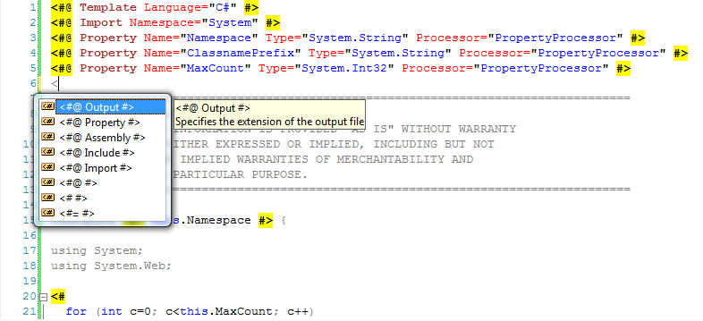

Подсветка для редактора T4
==========================

        published: 2009-02-01 
        tags: t4,.net 
        permalink: https://andir-notes.blogspot.com/2009/02/t4.html

Visual Studio 2008 не очень радует пользователей T4 (см. [предыдущую заметку](http://andir-notes.blogspot.com/2009/02/t4-visual-studio.html "T4 - Генератор кода встроенный в Visual Studio")), но, к счастью, существует редактор от сторонних поставщиков, который обеспечивает и подсветку кода (как шаблонов, так и вставок C# кода) и Intellisense.

Название: [T4 Editor](http://www.t4editor.net/)

Цена: 99$, но существует бесплатная версия [T4 Editor Community edition for VS 2008](http://www.t4editor.net/downloads.html).

 