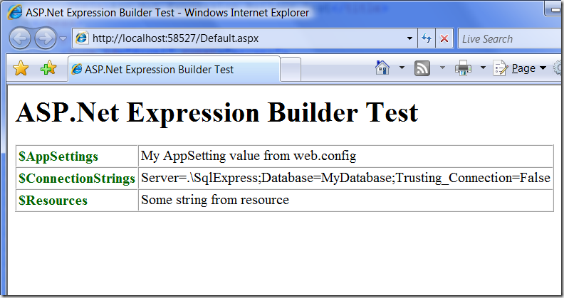
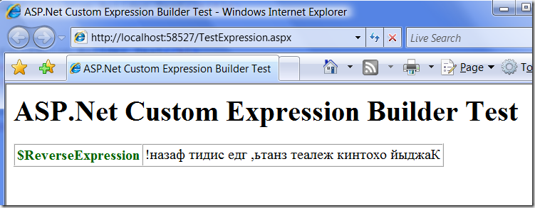

ASP.Net Expression Builders
===========================

        published: 2009-02-02 
        tags: asp.net,trick 
        permalink: https://andir-notes.blogspot.com/2009/02/aspnet-expression-builders.html

В этой заметке я хочу описать малоизвестный и практически неиспользуемый трюк в ASP.Net.

_Примечание: Это первая часть статьи про Expressions Builders. Обратите внимание, что есть и_ [_вторая часть_](http://andir-notes.blogspot.com/2009/02/aspnet-expression-builders_19.html "Andir: ASP.Net Expression Builders. Редактор своего типа выражений.")_._

Речь пойдёт о механизме расширения возможностей инлайн-разметки в виде декларативных выражений _<%$ ExpressionPrefix: ExpressionKey %>_. Возможность использования таких выражений предоставляется механизмом под названием **Expression Builders**.

``` xml
<asp:Literal runat="server" Text='<%$ ExpressionPrefix: ExpressionKey %>' />
```

Каждое выражение состоит из префикса _ExpressionPrefix_ и ключевого элемента _ExpressionKey_. По префиксу определяется соответствующий _Expression Builder_, который отвечает за вычисление значения выражения по ключу ExpressionKey.

Суть работы Expression Builders: выражение парсится и по префиксу ищется ранее зарегистрированный билдер, который затем генерирует код для получения значения этого выражения на этапе выполнения.

#### Стандартные билдеры

По умолчанию, в ASP.Net зарегистрировано три набора ExpressionBuilder.

1.  **<%$ ConnectionStrings: ConnectionStringName %>**,
2.  **<%$ AppSettings: AppSettingKey %>**,
3.  **<%$ Resources: ResourceFileName, ResourceKey %>**.

Как, собственно, можно понять из их префиксов, они занимаются генерацией кода для подстановки значений из Web.config и глобальных ресурсов приложения.

_Примечание: Увидеть, воочию, их регистрацию можно в файле \[%SystemRoot%\\Microsoft.NET\\Framework\\v2.0.50727\\CONFIG\\Web.config\] и далее ищем секции \[configuration/system.web/compilation/expressionBuilders\]_

Протестируем их работу:

**web.config:**

``` xml
<?xml version="1.0"?>
<configuration>
    <appSettings>
        <add key="MyAppSetting" value="My AppSetting value from web.config"/>
    </appSettings>

    <connectionStrings>
        <add name="MyConnectionString" connectionString="Server=.\SqlExpress;Database=MyDatabase;Trusting_Connection=False"/>
    </connectionStrings>
</configuration>
```

**App_GlobalResources\MyResources.resx:**
``` xml
<?xml version="1.0" encoding="utf-8"?>
<root>
    <!-- Removed unnecessary details -->
    <data name="MyResourceKey" xml:space="preserve">
        <value>Some string from resource</value>
    </data>
</root>
```

**default.aspx:**

``` html
<%@ Page Language="C#" AutoEventWireup="true" CodeBehind="Default.aspx.cs" Inherits="Home.Andir.Examples.DefaultPage" %>

<!DOCTYPE html PUBLIC "-//W3C//DTD XHTML 1.0 Transitional//EN" "http://www.w3.org/TR/xhtml1/DTD/xhtml1-transitional.dtd">
<html xmlns="http://www.w3.org/1999/xhtml">
<head runat="server">
    <title>ASP.Net Expression Builder Test</title>
</head>
<body>
    <h1>ASP.Net Expression Builder Test</h1>
    <table border="1" cellpadding="3" cellspacing="0">
        <col style="color: DarkGreen" align="left" />
        <tr>
            <th>$AppSettings</th>
            <td><asp:Label runat="server" Text='<%$ AppSettings: MyAppSetting %>' /></td>
        </tr>
        <tr>
            <th>$ConnectionStrings</th>
            <td><asp:Label runat="server" Text='<%$ ConnectionStrings: MyConnectionString %>' /></td>
        </tr>
        <tr>
            <th>$Resources</th>
            <td><asp:Label runat="server" Text='<%$ Resources: MyResources, MyResourceKey %>' /></td>
        </tr>
    </table>
</body>
</html>
```

Запускаем и смотрим результат:

[](expressionstest[3].png)

Как видим, все значения из файла конфигурации и глобальных ресурсов вывелись на экран.

#### Реализуем свой билдер

Как уже было упомянуто, механизм генерации кода “Expression Builders” является расширяемым и можно реализовать собственное выражение. Для этого нужно создать наследник абстрактного класса ExpressionBuilder и реализовать метод GetCodeExpression. Этот метод возвращает свой результат в виде CodeDom Expression.

Реализуем примитивный билдер, который переворачивает зеркально свой аргумент.

**ReverseExpressionBuilder.cs**

``` cs
using System.CodeDom;
using System.Linq;
using System.Web.Compilation;
using System.Web.UI;

namespace Home.Andir.Examples
{
    public class ReverseExpressionBuilder : ExpressionBuilder
    {
        public override CodeExpression GetCodeExpression(
            BoundPropertyEntry entry,
            object parsedData,
            ExpressionBuilderContext context)
        {
            string key = entry.Expression;

            return new CodePrimitiveExpression(
                ReverseString(key)
                );
        }

        private static string ReverseString(string key)
        {
            return new string(key.ToCharArray().Reverse().ToArray());
        }
    }
}
```

После того, как реализовали свой ExpressionBuilder необходимо зарегистрировать новое выражение и связать с ним префикс. Делается это в файле конфигурации.

**Web.config** 

``` xml
<?xml version="1.0"?>
<configuration>
    <system.web>
        <compilation debug="true">
            <expressionBuilders>
                <add expressionPrefix="ReverseExpression"
                    type="Home.Andir.Examples.ReverseExpressionBuilder"
                    />
            </expressionBuilders>
        </compilation>
    </system.web>
</configuration>
```

После регистрации префикса, выражение можно использовать в разметке ASP.Net.

**TestExpression.aspx**

``` html
<%@ Page Language="C#" AutoEventWireup="true" CodeBehind="TestExpression.aspx.cs" Inherits="Home.Andir.Examples.TestExpressionPage" %>
<!DOCTYPE html PUBLIC "-//W3C//DTD XHTML 1.0 Transitional//EN" "http://www.w3.org/TR/xhtml1/DTD/xhtml1-transitional.dtd">
<html xmlns="http://www.w3.org/1999/xhtml">
<head runat="server">
    <title>ASP.Net Custom Expression Builder Test</title>
</head>
<body>
    <h1>ASP.Net Custom Expression Builder Test</h1>
    <table border="1" cellpadding="3" cellspacing="0">
        <col style="color: DarkGreen" align="left" />
        <tr>
            <th>$ReverseExpression</th>
            <td><asp:Label runat="server" Text='<%$ ReverseExpression: Каждый охотник желает знать, где сидит фазан! %>' /></td>
        </tr>
    </table>
</body>
</html>
```

Результат:

[](reverseexpression[5].png)

Как видно на скриншоте, наше выражение успешно отработало.

Осталось только посмотреть как это работает изнутри и для этого заглянем в результат компиляции страницы _TestExpression.aspx_ (несущественные детали выкинуты).

_Примечание: Результаты компиляции страниц ASP.Net всегда можно найти в папке \[%SystemRoot%\\Microsoft.NET\\Framework\\v2.0.50727\\Temporary ASP.NET Files\]._

``` cs
// ------------------------------------------------------------------------------
// <auto-generated>
//     This code was generated by a tool.
//     Runtime Version:2.0.50727.3053
//
//     Changes to this file may cause incorrect behavior and will be lost if
//     the code is regenerated.
// </auto-generated>
//------------------------------------------------------------------------------

namespace ASP
{
    [System.Runtime.CompilerServices.CompilerGlobalScopeAttribute()]
    public class testexpression_aspx : global::Home.Andir.Examples.TestExpressionPage, System.Web.SessionState.IRequiresSessionState, System.Web.IHttpHandler
    {
        // details skipped ...
        [System.Diagnostics.DebuggerNonUserCodeAttribute()]
        private global::System.Web.UI.WebControls.Label @__BuildControl__control4()
        {
            global::System.Web.UI.WebControls.Label @__ctrl;
            @__ctrl = new global::System.Web.UI.WebControls.Label();
            @__ctrl.ApplyStyleSheetSkin(this);
            @__ctrl.Text = System.Convert.ToString("!назаф тидис едг ,ьтанз теалеж кинтохо йыджаК", System.Globalization.CultureInfo.CurrentCulture);
            return @__ctrl;
        }

        [System.Diagnostics.DebuggerNonUserCodeAttribute()]
        public override void ProcessRequest(System.Web.HttpContext context)
        {
            base.ProcessRequest(context);
        }
    }
}
```

То есть в результате парсинга страницы, в сгенерированный код автоматически был встроен результат выполнения **ReverseExpressionBuilder.GetCodeExpression(…)**.

#### Где об этом почитать

*   MSDN: [ExpressionBuilder class](http://msdn.microsoft.com/en-us/library/system.web.compilation.expressionbuilder.aspx).