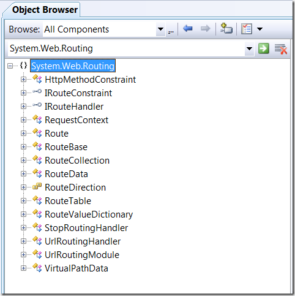
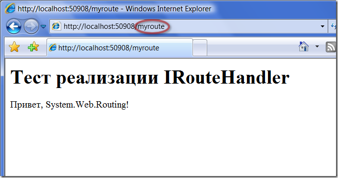
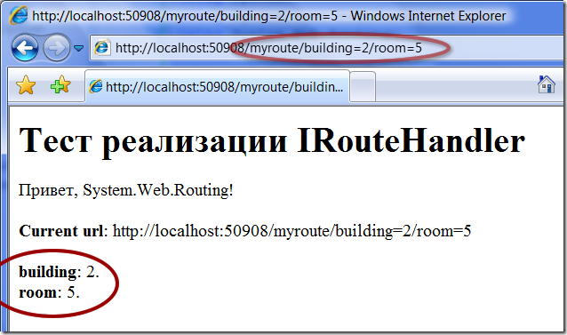

Возможности System.Web.Routing
==============================

        published: 2009-02-06 
        tags: system.web.routing,asp.net 
        permalink: https://andir-notes.blogspot.com/2009/02/systemwebrouting.html

Ещё в первых альфах технологии ASP.Net MVC был замечен модуль, который занимался самым классическим [Url Rewriting-ом](http://en.wikipedia.org/wiki/URL_rewriting "Википедия: Url Rewriting [en]"), к необходимости которого постепенно добирается каждый более-менее опытный web-программист. Позднее этот модуль был выделен в отдельную сборку System.Web.Routing и вошёл в состав .Net Framework 3.5 SP1.

_Примечание: На сегодняшний день актуальной версией ASP.Net MVC является [Release Candidate 1](http://haacked.com/archive/2009/01/27/aspnetmvc-release-candidate.aspx), и продукт стремительно приближается к своему первому релизу._

_Примечание: System.Web.Routing.dll можно найти в папке \[%ProgramFiles%\\Reference Assemblies\\Microsoft\\Framework\\v3.5\]_

#### Содержимое System.Web.Routing

Если заглянуть в это пространство имён, то там можно найти несколько основных вещей:

*   **UrlRoutingModule** – Http-модуль для поддержки маршрутизации (routing),
*   **RouteBase** – класс для реализации логики маршрутизации,
*   **RouteTable** – глобальная таблица маршрутов, которая используется модулем маршрутизации.

[](system.web.routing5.png)

#### Логика работы

ASP.Net Приложение во время загрузки регистрирует модуль UrlRoutingModule, который подписывается на два события: PostMapRequestHandler и PostResolveRequestCache. Основным событием является PostMapRequestHandler, которое возникает после того (Post-префикс) как механизм ASP.Net нашёл подходящий хэндлер (IHttpHandler) для текущего запроса. Модуль делает поиск в таблице маршрутов (RouteTable) среди зарегистрированных маршрутов (RouteBase), и если найден маршрут, который соответствует текущему запросу, то вызывается HttpContext.RewritePath() и текущий хэндлер заменяется на тот, который найден в таблице маршрутизации.

_Примечание: Поиск маршрута в таблице производится опосредованно, через опрос каждого объекта RouteBase на предмет, а не может ли тот обработать текущий запрос._

#### Переходим к практике

Как же пользоваться всем этим.

Регистрируем модуль **UrlRoutingModule** в **web.config**.

``` xml
<?xml version="1.0"?>
<configuration>
    <system.web>
        <compilation debug="true" />
        <httpModules>
            <add name="UrlRoutingModule"
                type="System.Web.Routing.UrlRoutingModule, System.Web.Routing, Version=3.5.0.0, Culture=neutral, PublicKeyToken=31BF3856AD364E35"
                />
        </httpModules>
    </system.web>
</configuration>
```

Теперь каждый наш запрос будет проходить через этот модуль, но пока ничего происходить не будет. Чтобы этот модуль начал делать какую-нибудь полезную работу необходимо заполнить таблицу маршрутов. Это нужно проделать где-то глобально для всего приложения, ну а стандартным местом для таких операций является класс **Global** и его метод _Application\_Start_. Примерно так:

**Global.asax.cs**

``` cs
using System;
using System.Web.Routing;

namespace Home.Andir.Examples
{
    public class Global : System.Web.HttpApplication
    {
        protected void Application_Start(object sender, EventArgs e)
        {
            RouteTable.Routes.Add(
                new Route("myroute", new StopRoutingHandler()));
        }
    }
}
```

Заметим, что в коллекцию **RouteCollection** можно добавлять только наследников класса **RouteBase**, единственным вариантов в **System.Web.Routing** является класс **Route**, который собой представляет реализацию некоторого маршрута. В минимальном конструкторе класса **Route** два параметра, первый – это строка, относительно которой матчится Url текущего запроса, второй – это реализация **IRouteHandler**, который позволяет для данного маршрута подобрать подходящий **IHttpHandler**. Конкретно, в данном случае, я задал маршрут статической строкой /myroute/ и в качестве хэндлера передал единственный доступный вариант реализации хэндлера **StopRoutingHandler**_._

Вот и всё, System.Web.Routing уже заработал. Правда, если запустить этот пример и ввести в Url [http://xxxx/myroute](http://xxxx/myroute) то, к сожалению, ничего не произойдёт. Проблема в том самом **StopRouteHandler**, который, на самом деле, ничего не делает и только предписывает модулю **UrlRoutingModule** игнорировать все правила. Чтобы увидеть систему в действии понадобится реализовать собственный вариант **IRouteHandler**.

**SimplePageRouteHandler.cs**

``` cs
using System.Web;
using System.Web.Routing;
using System.Web.UI;

namespace Home.Andir.Examples
{
    public class SimplePageRouteHandler : IRouteHandler
    {
        #region IRouteHandler Members

        public IHttpHandler GetHttpHandler(RequestContext requestContext)
        {
            var page = new Page();

            page.Controls.Add(
                new LiteralControl("<h1>Тест реализации IRouteHandler</h1>"));
            page.Controls.Add(
                new LiteralControl("<p>Привет, System.Web.Routing!</p>"));

            return page;
        }

        #endregion
    }
}
```

Как видно из кода, ничего сложного в этом нет, необходимо только реализовать один метод _GetHttpHandler_, который на основе requestContext возвращает подходящий обработчик запроса. В данном случае, это будет класс **Page**.

Подправляем **Global.asax.cs**

``` cs
using System;
using System.Web.Routing;

namespace Home.Andir.Examples
{
    public class Global : System.Web.HttpApplication
    {
        protected void Application_Start(object sender, EventArgs e)
        {
            RouteTable.Routes.Add(
                new Route("myroute", new SimplePageRouteHandler()));
        }
    }
}
```

Запускаем и получаем ожидаемый результат:

 [](SimplePageRouteHandler5.png)

Как видим для маршрута myroute отработал наш хэндлер.

#### Возможности объекта Route

Итак, у нас получилось для некоторого маршрута myroute задать свой **IRouteHandler** и увидеть его в действии. Но это не единственное, что умеет объект **Route**, основная его задача состоит в том, позволить задать динамический маршрут, который может содержать некоторые параметры.

Динамические маршруты задаются с помощью специального синтаксиса. Шаблон маршрута представляет собой строку, в которой параметры заключаются в фигурные скобки, а слеш ‘/’ служит основным разделителем (можно считать, что значение параметра не может содержать ‘/’).

Примеры:

*   “content/page/{number}” – здесь добавлен параметр ‘number’, этому шаблону будет соответствовать значения “content/page/1”, “content/page/trash”,
*   “page.aspx?number={number}” – аналогично предыдущему, соответствия “page.aspx?number=1”, “page.aspx?number=trash”,
*   “{controller}/{action}/{id}” – три параметра, которые намекают, что эти маршруты, видимо, относятся к ASP.Net MVC.

Модифицируем предыдущий пример, чтобы увидеть маршруты с параметрами в действии.

Для начала, переделаем реализацию **SimplePageRouteHandler**, чтобы он мог выводить параметры текущего маршрута, которые получены из Url. Эти параметры можно получить из контекста, который является параметром метода _GetHttpHandler_.

**SimplePageRouteHandler.cs**

``` cs
using System;
using System.Web;
using System.Web.Routing;
using System.Web.UI;
using System.Web.UI.WebControls;

namespace Home.Andir.Examples
{
    public class SimplePageRouteHandler : IRouteHandler
    {
        #region IRouteHandler Members

        public IHttpHandler GetHttpHandler(RequestContext requestContext)
        {
            return CreateIHttpHandler(requestContext.RouteData);
        }

        #endregion

        private static IHttpHandler CreateIHttpHandler(RouteData routeData)
        {
            Panel paramsPanel = new Panel()
            {
                Width = Unit.Percentage(50)
            };

            RenderParams(paramsPanel, routeData);

            var page = new Page();

            RenderPage(page);

            page.Controls.Add(paramsPanel);

            return page;
        }

        private static void RenderPage(Control page)
        {
            page.Controls.Add(
                new LiteralControl("<h1>Тест реализации IRouteHandler</h1>"));

            page.Controls.Add(
                new LiteralControl("<p>Привет, System.Web.Routing!</p>"));

            var request = HttpContext.Current.Request;

            page.Controls.Add(
                new LiteralControl(String.Format("<p><b>Current url</b>: {0}</p>", request.Url.ToString())));
        }

        private static void RenderParams(Control panel, RouteData routeDate)
        {
            foreach (var param in routeDate.Values)
                panel.Controls.Add(
                    new LiteralControl(String.Format("<b>{0}</b>: {1}.<br/>", param.Key, param.Value)));
        }
    }
}
```

Теперь зададим несколько динамических маршрутов и посмотрим что получится.

**Global.asax.cs**

``` cs
using System;
using System.Web.Routing;

namespace Home.Andir.Examples
{
    public class Global : System.Web.HttpApplication
    {
        protected void Application_Start(object sender, EventArgs e)
        {
            RouteTable.Routes.Add(
                new Route(
                    "myroute",
                    new SimplePageRouteHandler()));
            RouteTable.Routes.Add(
                new Route(
                    "myroute/building={building}",
                    new SimplePageRouteHandler()));
            RouteTable.Routes.Add(
                new Route(
                    "myroute/building={building}/room={room}",
                    new SimplePageRouteHandler()));
        }
    }
}
```

Смотрим результат:

[](SimplePageRouteHandler_Dynamic3.png)

Как видим, значения и имена параметров были успешно извлечены из контекста IRouteHandler.

На этом возможности объекта Route не заканчиваются: параметрам можно задавать значения по умолчанию, и накладывать ограничения. Но об этом, пожалуй, в рамках [другой заметки](http://andir-notes.blogspot.com/search/label/system.web.routing).