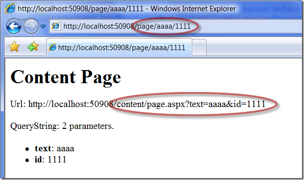
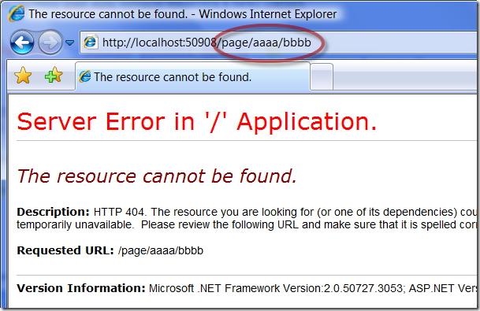

Реализация простого Url rewriting с помощью System.Web.Routing
==============================================================

        published: 2009-02-06 
        tags: system.web.routing,asp.net
        permalink: https://andir-notes.blogspot.com/2009/02/url-rewriting-systemwebrouting.html

В прошлой [заметке](http://andir-notes.blogspot.com/2009/02/systemwebrouting.html "Возможности System.Web.Routing") я описал примитивное использование возможностей System.Web.Routing. Воспользуемся этим знанием и реализуем простой [Url rewriting](http://en.wikipedia.org/wiki/URL_rewriting "Википедия: Url Rewriting (en)") на основе System.Web.Routing, который из учебных целей реализуем с помощью матчинга регулярными выражениями (System.Text.RegularExpressions.Regex).

Итак, регистрируем UrlRewritingModule в **web.config**

``` xml
<?xml version="1.0"?>
<configuration>
    <system.web>
        <compilation debug="true" />
        <httpModules>
            <add name="UrlRoutingModule"
                type="System.Web.Routing.UrlRoutingModule, System.Web.Routing, Version=3.5.0.0, Culture=neutral, PublicKeyToken=31BF3856AD364E35"
                />
        </httpModules>
    </system.web>
</configuration>
```

Регистрируем некоторый произвольный маршрут:

**Global.asax.cs**
``` cs
using System;
using System.Text.RegularExpressions;
using System.Web.Routing;

namespace Home.Andir.Examples
{
    public class Global : System.Web.HttpApplication
    {
        protected void Application_Start(object sender, EventArgs e)
        {
            RegisterRoutes(RouteTable.Routes);
        }

        private void RegisterRoutes(RouteCollection routes)
        {
            routes.Add(
                new RegexRoute(
                    new Regex(@"~/page/(?<text>\w+)/(?<id>\d+)$"),
                    "~/content/page.aspx?text=${text}&id=${id}")
                    );
        }
    }
}
```

В данном случае, я использую **RegexRoute**, реализация которого будет представлена ниже. В конструкторе RegexRoute принимает два параметра: регулярное выражение и строку которая будет служить результатом переписывания Url. 

**RegexRoute.cs**
``` cs
using System.Text.RegularExpressions;
using System.Web;
using System.Web.Routing;

namespace Home.Andir.Examples
{
    public sealed class RegexRoute : RouteBase
    {
        public const string RouteDataDestinationKey = "Home.Andir.Examples.RegexRoute.Destination";

        public Regex SourceExpression { get; set; }

        public string Destination { get; set; }

        public IRouteHandler RouteHandler { get; private set; }

        public RegexRoute(Regex sourceExpression,
            string destination)
        {
            this.SourceExpression = sourceExpression;
            this.Destination = destination;
            this.RouteHandler = new WebFormRewriteRouteHandler();
        }

        private static string GetCurrentVirtualPath(HttpRequestBase request)
        {
            return request.AppRelativeCurrentExecutionFilePath
                + request.PathInfo;
        }

        public override RouteData GetRouteData(HttpContextBase httpContext)
        {
            var virtualPath = GetCurrentVirtualPath(httpContext.Request);

            if (SourceExpression.IsMatch(virtualPath))
            {
                var resultPath = SourceExpression.Replace(virtualPath, Destination);

                var data = new RouteData(this, RouteHandler);
                if (data.Values.ContainsKey(RouteDataDestinationKey))
                {
                    data.Values[RouteDataDestinationKey] = resultPath;
                }
                else
                {
                    data.Values.Add(RouteDataDestinationKey, resultPath);
                }

                return data;
            }

            return null;
        }

        public override VirtualPathData GetVirtualPath(
            RequestContext requestContext,
            RouteValueDictionary values)
        {
            if (values.ContainsKey(RouteDataDestinationKey))
            {
                var virtualPathAndQuery = values[RouteDataDestinationKey].ToString();

                return new VirtualPathData(this, virtualPathAndQuery);
            }

            return null;
        }
    }
}
```

Этой реализации, и, вообще, типичной реализации наследника **RouteBase** требуются пояснения.

Как видно, реализуются два основных метода _GetRouteData_ и _GetVirtualPath._ Обсудим особенности реализации каждого из них.

*   _GetRouteData_ предназначен для матчинга текущего маршрута и, в случае удачи, заполнения словаря **RouteData**, в который помещаются некоторые данные характерные для данного маршрута. В данном случае, в этот словарь попадает результирующий Url, получившийся из применения к текущему Url регулярного выражения SourceExpression и строчки замены Destination.
*   _GetVirtualPath_ занимается тем, что для данного маршрута изымает данные из словаря **RouteData** и возвращает объект **VirtualPathData**.

Мне осталось реализовать **WebFormRewriteRouteHandler,** который вернёт управление некоторому хендлеру ASP.Net. В данном случае это будет наследник **System.Web.UI.Page**.

**WebFormRewriteRouteHandler.cs**

``` cs
using System.Web;
using System.Web.Compilation;
using System.Web.Routing;
using System.Web.UI;

namespace Home.Andir.Examples
{
    public sealed class WebFormRewriteRouteHandler : IRouteHandler
    {
        #region IRouteHandler Members

        public IHttpHandler GetHttpHandler(RequestContext requestContext)
        {
            var routeData = requestContext.RouteData;
            var virtualPathData =
                routeData.Route.GetVirtualPath(requestContext, routeData.Values);

            requestContext.HttpContext.RewritePath(virtualPathData.VirtualPath);

            return (Page)BuildManager.CreateInstanceFromVirtualPath(
                ExtractPagePath(virtualPathData.VirtualPath),
                typeof(Page)
                );
        } 

        #endregion

        private static string ExtractPagePath(string pathAndQuery)
        {
            var virtualPath = pathAndQuery;
            var queryIndex = pathAndQuery.IndexOf("?");
            if (queryIndex != -1)
                virtualPath = pathAndQuery.Substring(0, queryIndex);
            return virtualPath;
        }
    }
}
```

Что здесь происходит: из контекста извлекается текущий **Route** и у него вызывается метод _GetVirtualPath,_ затем полученный результат отдаём в метод **HttpContext**._RewritePath_, который извлечёт параметры из виртуального пути и подменит их в текущем контексте.

Ну вот и почти всё готово, осталось реализовать страницу page.aspx, которую следует поместить в папку content.

**content/page.aspx**

``` html
<%@ Page Language="C#" MasterPageFile="~/Shared/default.Master" %>
<asp:Content ID="Content1" ContentPlaceHolderID="ContentPlaceHolder1" runat="server">
    <h1>Content Page</h1>
    <p>Url: <%= Request.Url.ToString() %></p>
    <p>QueryString: <%= Request.QueryString.Count %> parameters.</p>
    <ul>
    <% foreach (string paramName in Request.QueryString)
       { %>
        <li><b><%= paramName %></b>: <%= Request.QueryString[paramName] %></li>      
    <% } %>
    </ul>
</asp:Content>
```

Уфф, ну вот и всё, теперь можно протестировать, то что получилось.

Напомню, что зарегистрирован маршрут, который матчится с помощью регулярного выражения: @"~/page/(?<text>\\w+)/(?<id>\\d+)$" , что в переводе означает Url состоит из трёх сегментов: статической строки ‘page’, некоторой произвольной строки, и произвольного числа.

[](RegexRoute[3].png)

Протестируем маршрут, который не удовлетворяет регулярному выражению:

[](RegexRouteNotMatched[3].png)

Как видим, минимальная реализация вполне работоспособна.