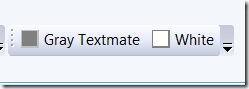

Макрос для смены цветовой схемы в Visual Studio
===============================================

    published: 2009-02-08 
    tags: visual studio 
    permalink: https://andir-notes.blogspot.com/2009/02/visual-studio.html

В дополнение к [предыдущей заметке](http://andir-notes.blogspot.com/2009/02/textmate-visual-studio.html "Andir: Textmate–like цветовая схема для Visual Studio") о смене цветов в редакторе студии. Чтобы было удобно менять цветовую схему по своему вкусу, можно использовать небольшой макрос, который затем вынести на кнопочку в тулбаре студии.

``` vb
Public Module MainModule
    Sub SetWhiteThemeMacros()
        DTE.ExecuteCommand("Tools.ImportandExportSettings", _
             "/import:%VSTHEMESPATH%\\White\_Theme.vssettings")
    End Sub

    Sub SetGrayTextmateThemeMacros()
        DTE.ExecuteCommand("Tools.ImportandExportSettings", _
             "/import:%VSTHEMESPATH%\\Grayed\_Textmate\_Theme.vssettings")
    End Sub
End Module
```

_Примечание: Необходимо заменить %VSTHEMESPATH% на реальный путь, где вы предварительно сложили файлы \*.vssettings._

Получается симпатичный и быстрый способ смены цветовой схемы:

