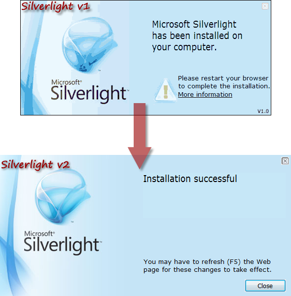
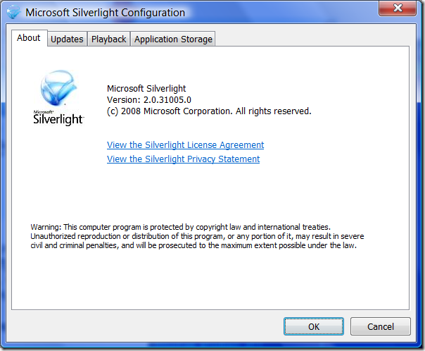
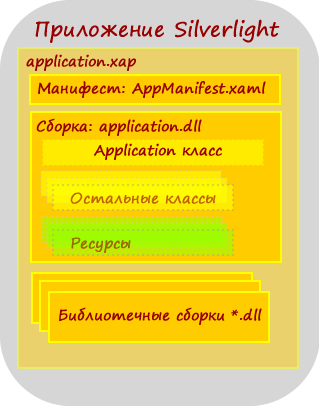
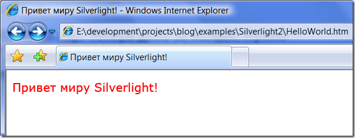
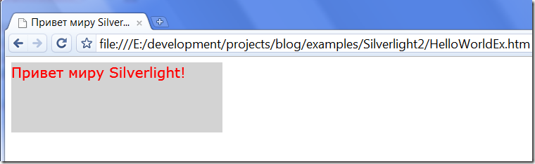
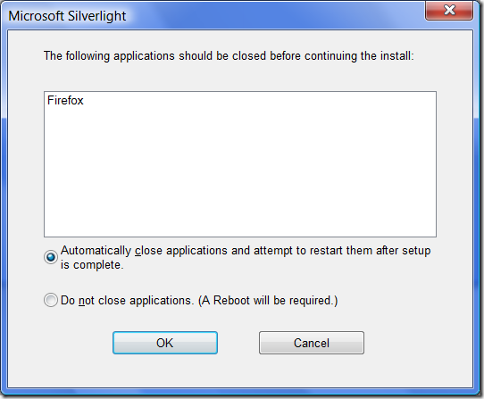

Фокус на Silverlight 2
======================

        published: 2009-02-11
        tags: silverlight 
        permalink: https://andir-notes.blogspot.com/2009/02/silverlight-2.html

Когда-то давным-давно, в самый момент рождения этого блога, первой моей заметкой получился мини-обзор первой версии технологии Silverlight: [“Фокус на Silverlight”](http://andir-notes.blogspot.com/2007/09/silverlight.html "Andir: Фокус на Silverlight"). Тем временем, технологии движутся вперёд с космической скоростью, и Silverlight уже достиг [второй версии](http://weblogs.asp.net/scottgu/archive/2008/10/14/silverlight-2-released.aspx "ScottGu: Silverlight 2 Released"). Новая заметка, как уже ясно из названия, – это сиквел первой части, и главную роль в ней исполняет уже Silverlight 2.

_Примечание: А между тем Microsoft уже вовсю обещает выпустить и_ [_третью версию_](http://weblogs.asp.net/scottgu/archive/2008/11/16/update-on-silverlight-2-and-a-glimpse-of-silverlight-3.aspx "ScottGu: Update on Silverlight 2 - and a glimpse of Silverlight 3")_._

#### Введение

Дата релиза: 14 октября 2008 года.

[Инструментарий](http://silverlight.net/GetStarted/): Silverlight Tools for Visual Studio 2008 SP1, Expression Blend SP1, Silverlight Toolkit.

Платформы: Internet Explorer, Mozilla Firefox, Google Chrome.

_Примечание: Нынче_ [_Silverlight 2 SDK_](http://www.microsoft.com/downloads/details.aspx?FamilyID=8D933343-038F-499C-986C-C3C7E87A60B3&displaylang=en "Microsoft: Silverlight 2 SDK") _входит в состав Silverlight Tools for Visual Studio 2008 SP1, но его можно скачать и отдельно, плюс документация доступна и в виде [chm](http://www.microsoft.com/downloads/details.aspx?FamilyID=bce7684a-507b-4fc6-bc99-6933cd690cab&displaylang=en "Microsoft: Microsoft® Silverlight™ 2 Software Development Kit Documentation"). Также полезным дополнением к инструментарию является версия Silverlight предназначенная специально для разработчиков:_ [_Silverlight for Developers_](http://go.microsoft.com/fwlink/?linkid=119972 "Microsoft: Silverlight for Developers")_._

#### Инсталлируем

Для начала, конечно же, Silverlight plugin следует проинсталлировать. Лучшим местом откуда это можно сделать является сайт [silverlight.net](http://silverlight.net/GetStarted/ "Silverlight.net: Get Started").

_Примечание: Доброй традицией от Microsoft стало создавать отдельный веб-сайт для своих новых технологий для объединения заинтересованных пользователей (forcing community, если говорить английскими словами). Примеры: IIS.Net, ASP.Net, WindowsClient.net и др._

Инсталляция проходит всё также тихо, легко и быстро. 0, 90, 99% и вот она закончилась.

На этом этапе уже заметно первое, бросающееся на глаза, качественное изменение. Всё таки работают над ошибками юзабелисты Микрософта.

 

Как видно на скриншоте, в новой версии появилась кнопочка “Close” и браузер больше не требуется перезапускать вручную, достаточно обновить страницу и даже более того, если меня не обманули мои глаза, то в моём Firefox 3 автоматически перезагрузилась активная страничка и там сразу же заработал плагин Silverlight.

_Примечание: Глаза действительно не обманули, если заглянуть в стандартный Silverlight.js, то там можно обнаружить код ответственный за обновление страницы после окончания инсталляции._

#### Препарируем

Итак, плагин установлен. Посмотрим что у него внутри. Инсталляция прошла в папку \[%ProgramFiles%\\Microsoft Silverlight\\2.0.31005.0\\\], общий объём составил около 12Мб.

Внутри можно найти реализацию CLR (clrcore.dll), небольшую часть .Net (mscorlib.dll и System.\*.dll), сам плагин npctrl.dll (интересно, почему такое название?), набор ресурсов и утилиту конфигурирования Silverlight.Configuration.exe.

Набор dll, косвенно напоминающих соответствующие в .Net обеспечивают основные возможности приложений Silverlight:

*   System.dll, System.Core.dll – реализация базовых вещей .Net (в том числе и Linq),
*   System.Net.dll – возможности сетевого взаимодействия,
*   System.Runtime.Serialization.dll – поддержка сериализации объектов,
*   System.ServiceModel.dll, System.ServiceModel.Web.dll – поддержка WCF,
*   System.Windows.dll, System.Windows.Browser.dll – подмножество WPF для поддержки XAML,
*   System.Xml.dll – работа с Xml.

Утилита конфигурирования запускается по правой кнопке мыши из меню, во время просмотра любого проигрываемого ролика.



И включает в себя всего несколько параметров: Автоматическое обновления, поддержка DRM и настройки хранения локальных данных приложений Silverlight (квоты на объём).

#### Привет, Silverlight 2!

Пришла пора реализовать стандартный “Hello, World” и испробовать малую толику возможностей технологии. А чтобы лучше понять внутреннее устройство приложений от Silverlight проделаем всю необходимую работу _без использования студии_ (за исключением редактора кода).

Для начала нам понадобится XAML-файл, который должен будет выводить приветственную надпись на экран. Выглядеть он будет примерно так:

**HelloWorld.xaml**

``` xml
<Canvas
   xmlns="http://schemas.microsoft.com/winfx/2006/xaml/presentation"
   xmlns:x="http://schemas.microsoft.com/winfx/2006/xaml"
   >
    <TextBlock
       Foreground="Red"
       FontSize="20"
       Text="Привет миру Silverlight!"
       />
</Canvas>
```

Внутреннее устройство приложений Silverlight, в отличие от первой версии, сильно изменилось. Обсудим его.



Каждое приложение представляет собой xap-пакет (zip-архив), который содержит упакованные сборки с зависимостями, ресурсы и манифест. Именно этот xap-пакет и является источником для плагина Silverlight.

Жизненный путь приложения Silverlight начинается при загрузке страницы на которой каким-либо образом активируется экземпляр плагина Silverlight. После этого, загружается xap-пакет, указанный как источник приложения для данного экземпляра. И, наконец, по окончании загрузки, плагин анализирует манифест загруженного приложения и запускает его.

Запуск приложения производится путём создания экземпляра специального класса, наследника **System.Windows.Application**. У этого класса определено несколько событий, которыми можно воспользоваться для инициализации приложения, закрытия приложения и обработки ошибок (_Startup, Exit, UnhandledException_). А также этот класс содержит свойство _RootVisual_, установка которого заставляет приложение отрендерить некоторый **System.Windows.UIElement**.

Минимальный вариант Silverlight приложения выглядит так:

**HelloWorldApp.cs (предварительная заглушка)**

``` cs
using System.Windows;

public class HelloWorldApp : Application
{
    public HelloWorldApp()
    {
        this.Startup += this.Application_Startup;
    }

    private void Application_Startup(object sender, StartupEventArgs e)
    {
        // Some initialization logics here
    }
}
```

Итак заглушка для приложения готова, теперь нужно как-то суметь проиграть тот самый XAML-файл, который мы сделали ранее. Для этого мы поступим следующим образом:

*   HelloWorld.xaml отправим в ресурсы приложения (во время компиляции укажем флаг /res:\[ResourceName\]),
*   Используем возможности класса **XamlReader**, который умеет осуществлять десереализацию XAML-строки в объект **UIElement**.
*   Результат десериализации присвоим свойству RootVisual, чтобы плагин смог отрендерить полученный **UIElement**.

Смотрим окончательный код:

**HelloWorldApp.cs**
``` cs
using System.IO;
using System.Reflection;
using System.Windows;
using System.Windows.Markup;

public class HelloWorldApp : Application
{
    public HelloWorldApp()
    {
        this.Startup += this.Application_Startup;
    }

    private void Application_Startup(object sender, StartupEventArgs e)
    {
        RootVisual = (UIElement)XamlReader.Load(
            GetResource("HelloWorld.xaml"));
    }

    private string GetResource(string resourceName)
    {
        var assembly = Assembly.GetExecutingAssembly();
        using (var reader = new StreamReader(
              assembly.GetManifestResourceStream(resourceName)
              ))
        {
            return reader.ReadToEnd();
        }
    }
}
```

Мы предполагаем, что в текущей сборке содержится ресурс с именем _HelloWorld.xaml_, который представляет собой правильный XAML-ресурс. И с помощью **XamlReader**._Load_ загружаем содержимое этого ресурса. Результат десериализации передаём свойству **HelloWorldApp**._RootVisual_.

Вот собственно и всё, приложение готово. Теперь его следует откомпилировать и собрать окончательный **HelloWorld.xap**.

Компиляция Silverlight приложений производится компилятором c# от .Net 3.5 с ключом /nostdlib+ (то есть без стандартной библиотеки по умолчанию).

**compile.bat**

``` bat
@set netfw=%SystemRoot%\Microsoft.NET\Framework\v3.5
@set slvsdk=%ProgramFiles%\Microsoft SDKs\Silverlight\v2.0\Reference Assemblies

%netfw%\Csc.exe /noconfig /nostdlib+ /r:"%slvsdk%\mscorlib.dll" /r:"%slvsdk%\System.Windows.dll" /res:HelloWorld.xaml /out:HelloWorldApp.dll /t:library HelloWorldApp.cs
```

Как видим, в зависимостях (флаг /r:) выставлены сборки из Silverlight SDK и в ресурсы (флаг /res:) добавлен наш XAML.

После успешной компиляции нам остаётся только создать специальный манифест для приложения Silverlight.

_Примечание: Как это не странно, но манифест тоже является валидным XAML-файлом._

**AppManifest.xaml**
``` xml
<Deployment
   xmlns="http://schemas.microsoft.com/client/2007/deployment"
   xmlns:x="http://schemas.microsoft.com/winfx/2006/xaml"
   EntryPointAssembly="HelloWorldApp"
   EntryPointType="HelloWorldApp"
   RuntimeVersion="2.0.31005.0">
  <Deployment.Parts>
    <AssemblyPart x:Name="HelloWorldApp" Source="HelloWorldApp.dll" />
  </Deployment.Parts>
</Deployment>
```

Вот теперь всё, осталось упаковать полученную сборку (HelloWorldApp.dll) и манифест в zip-архив, и у нас готов пакет, который можно уже будет исполнить в браузере. В данном случае, я использую консольный архиватор 7Zip, который умеет создавать и zip-архивы.

**xap.bat**

``` bat
7z a HelloWorld.xap -tzip HelloWorldApp.dll AppManifest.xaml
```

Уфф, всё. У нас получился файл HelloWorld.xap, теперь дело за малым. Нужно сделать хост для плагина Silverlight и отдать ему получившееся приложение.

Пишем примитивный **HelloWorld.htm**.

``` html
<html>
<head>
    <title>Привет миру Silverlight!</title>
    <script type="text/javascript" src="Silverlight.js"></script>
</head>
<body>
    <div id="silverlightHost">
        <object data="data:application/x-silverlight-2,"
            type="application/x-silverlight-2"
            Width="300" Height="100">
            <param name="source" value="HelloWorld.xap"/>
            <param name="background" value="white" />
            <param name="minRuntimeVersion" value="2.0.31005.0" />
        </object>
    </div>
</body>
</html>
```


_Примечание: Для запуска опять требуется некий магический Silverlight.js, который можно найти в Silverlight SDK._

Запускаем и получаем долгожданный результат:



Рассмотрим также альтернативный вариант создания проигрывателя Silverlight динамически:

**HelloWorldEx.htm**

``` html
<html>
<head>
    <title>Привет миру Silverlight!</title>
    <script type="text/javascript" src="Silverlight.js"></script>
    <script type="text/javascript">
    $ = function(id) { return document.getElementById(id); }
    if(window.attachEvent)
    {
        window.addEventListener = function( eventName, func, args ) {
            window.attachEvent('on' + eventName,
                function() { func(window.event, args);})
        }
    }

    function CreateSilverlightObject(hostElement)
    {
        Silverlight.createObject(
            'HelloWorld.xap',     // source
            hostElement,          // parentElement
            'silverlightPlugin',  // id
            {
                background: 'lightgray',
                version: '2.0.31005.0',
                width: 300,
                height: 100
            },                   // properties
            { onerror : function(sender, args) { alert(args.ErrorMessage); } }, // events
            null,                // initParams
            null                 // userContext
            );
    }

    window.addEventListener('load',
        function() { CreateSilverlightObject( $('silverlightHost') ); },
        null
        );
    </script>
</head>
<body>
    <div id="silverlightHost"></div>
</body>
</html>
```

Результат выполнения этого файла будет таким же, и чтобы не повторяться я сделал скриншот из _альтернативного_ браузера:



#### Деинсталляция

В принципе, ничего интересного, в этой процедуре нет, кроме небольшого ньюанса. Мне понравилось то, как команда Silverlight обошлась со стандартной процедурой удаления своего продукта.



То есть обнаружено, что запущен браузер, но вместо обычного в таких случаях предложения пользователю закрыть “неудобные” приложения предложено всё проделать автоматически. Занятно.

#### Эпилог

Ну вот собственно и всё, небольшой обзор технологии Silverlight 2 с точки зрения практикующего программиста можно считать оконченным. Результаты я хорошенько запаковал и их можно изучить при случае подробнее.

Полный проект можно скачать [здесь](http://sites.google.com/site/andirnotes/blogfiles/Silverlight2_Example.zip).