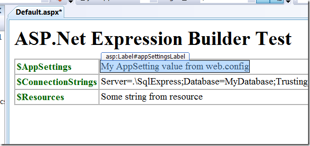
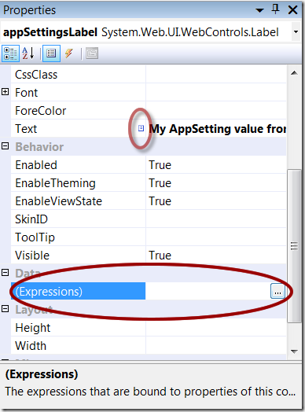
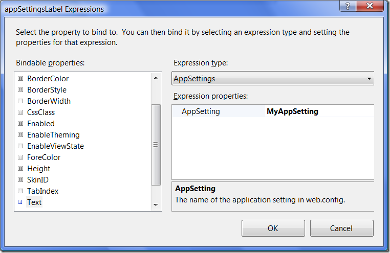
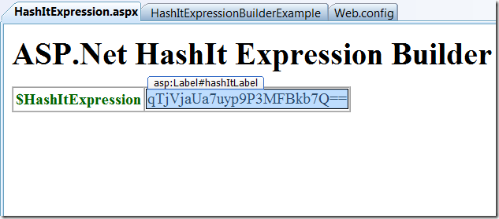
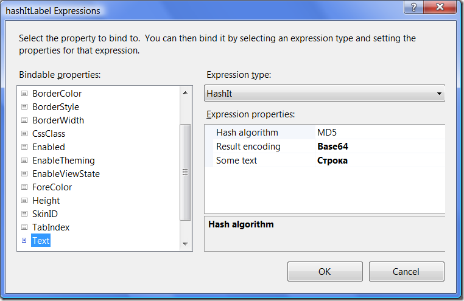

ASP.Net Expression Builders. Редактор своего типа выражений.
============================================================

2009-02-19 asp.net https://andir-notes.blogspot.com/2009/02/aspnet-expression-builders\_19.html

Продолжим играться с “построителями выражений” в ASP.Net.

_Примечание: Эта заметка является логическим продолжением заметки от 2 февраля:_ [_ASP.Net Expression Builders_](http://andir-notes.blogspot.com/2009/02/aspnet-expression-builders.html "Andir: ASP.Net Expression Builders")_._ 

Напомню, что существует три выражения поставляемые по умолчанию вместе с ASP.Net:

``` xml
<system.web>
    <compilation>
        <expressionBuilders>
            <add expressionPrefix="Resources"
                 type="System.Web.Compilation.ResourceExpressionBuilder"/>
            <add expressionPrefix="ConnectionStrings"
                 type="System.Web.Compilation.ConnectionStringsExpressionBuilder"/>
            <add expressionPrefix="AppSettings"
                 type="System.Web.Compilation.AppSettingsExpressionBuilder"/>
        </expressionBuilders>
    </compilation>
</system.web>
```

Для каждого из них существует некоторый редактор, который позволяет устанавливать значения свойств в Design-Time.

Рассмотрим нашу небольшую страничку:

**default.aspx**

``` html
<%@ Page Language="C#" AutoEventWireup="true"
    CodeBehind="Default.aspx.cs" %>
<!DOCTYPE html PUBLIC "-//W3C//DTD XHTML 1.0 Transitional//EN"
    "http://www.w3.org/TR/xhtml1/DTD/xhtml1-transitional.dtd">
<html xmlns="http://www.w3.org/1999/xhtml">
<head runat="server">
    <title>ASP.Net Expression Builder Test</title>
</head>
<body>
    <h1>ASP.Net Expression Builder Test</h1>
    <table border="1" cellpadding="3" cellspacing="0">
        <col style="color: DarkGreen" align="left" />
        <tr>
            <th>$AppSettings</th>
            <td>
                <asp:Label ID="appSettingsLabel" runat="server"
                           Text='<%$ AppSettings: MyAppSetting %>' />
            </td>
        </tr>
        <tr>
            <th>$ConnectionStrings</th>
            <td>
                <asp:Label ID="connectionStringsLabel" runat="server"
                           Text='<%$ ConnectionStrings: MyConnectionString %>' />
            </td>
        </tr>
        <tr>
            <th>$Resources</th>
            <td>
                <asp:Label ID="resourcesLabel" runat="server"
                           Text='<%$ Resources: MyResources, MyResourceKey %>' />
            </td>
        </tr>
    </table>
</body>
</html>
```

Переключаемся в просмотр дизайна:



Выбираем произвольный серверный контрол (на скриншоте у меня выбран первый _appSettingsLabel)_ и смотрим в окно Properties.



Вещи, на которые стоит обратить внимание я выделил. Первое, это маленький квадратик возле свойства **Text** – если к нему подвести мышь, то появиться подсказка “Property is expression bound.”. Второе, это секция Data и её элемент (Expressions). Именно в нём и скрыт редактор, который позволяет присваивать различным свойствам элемента значения параметрам выражения.

 

“Bindable properties” показывает список доступных свойств элемента управления к которым можно “прибиндить” выражение.

В выпадающем списке “Expression type” можно выбрать любой **ExpressionBuilder** зарегистрированный в web.config.

Теперь самое интересное. В окне “Expression properties” можно увидеть стандартный грид с набором свойств (да, на скриншоте видно только одно свойство, но если выбрать _Resources_ среди типов, то там будет уже два). Этот грид является “редактором” для выбранного типа выражения. И для своего типа выражения можно реализовать свой редактор.

Делается это с помощью атрибута **ExpressionEditorAttribute**, наследника **ExpressionEditor** (который находиться в System.Design.dll) и наследника **ExpressionEditorSheet**.

#### Реализация редактора свойств для выражения

В качестве выражения я буду использовать простенькое выражение HashItExpression. Синтаксис выдумаем следующим:

_<%$ HashIt: MD5(‘строка, хеш которой я хочу получить’) : Base64 %>_

Параметрами моего выражения будут служить:

*   Алгоритм хэширования (MD5, SHA1, SHA256, SHA512),
*   Текст в кавычках, который надо захешировать,
*   Кодировка в которой следует вывести получившийся набор байт (Base64 или Hex – строка в шестнадцатеричном представлений).

Вначале реализуем набор структур и функций, которые делают разбор выражения и вычисляют его значение.

**HashItEvaluator.cs**

``` cs
using System;
using System.Linq;
using System.Security.Cryptography;
using System.Text;
using System.Text.RegularExpressions;

namespace Home.Andir.Examples
{
    public enum HashAlg
    {
        MD5,
        SHA1,
        SHA256,
        SHA512
    }

    public enum EncodeType
    {
        Base64,
        Hex
    }

    public static class HashItEvaluator
    {
        public class HashItParseResults
        {
            public HashAlg HashAlg { get; set; }

            public string Source { get; set; }

            public EncodeType EncodeType { get; set; }
        }

        public static string Eval(string expression)
        {
            var parseResults = ParseExpression(expression);
            if (parseResults != null)
            {
                return Eval(parseResults);
            }

            return "Invalid expression";
        }

        private static string Eval(HashItParseResults parseResults)
        {
            HashAlgorithm hash = CreateAlgorithm(parseResults.HashAlg);

            var result = hash.ComputeHash(
                Encoding.Default.GetBytes(parseResults.Source));

            if (parseResults.EncodeType == EncodeType.Hex)
            {
                return String.Concat(
                    result.Select(x => String.Format("{0:x2}", x)).ToArray()
                    );
            }

            return Convert.ToBase64String(result);
        }

        private static HashAlgorithm CreateAlgorithm(HashAlg alg)
        {
            switch (alg)
            {
                case HashAlg.MD5: return MD5.Create();
                case HashAlg.SHA1: return new SHA1Managed();
                case HashAlg.SHA256: return new SHA256Managed();
                case HashAlg.SHA512: return new SHA512Managed();
            }

            throw new ArgumentOutOfRangeException("alg");
        }

        public static HashItParseResults ParseExpression(string expression)
        {
            // expression == MD5(source) [: Base64]
            Regex expRe = new Regex(
                @"(?<alg>MD5|SHA1|SHA256|SHA512)\('(?<source>.+)'\)(\s*:\s*(?<enc>(Base64|Hex)))?",
                RegexOptions.IgnoreCase
                );

            var match = expRe.Match(expression);
            if (match != null)
            {
                string alg = match.Groups["alg"].Value;
                string source = match.Groups["source"].Value;
                string enc = match.Groups["enc"].Value;

                return new HashItParseResults()
                {
                    HashAlg = (HashAlg)Enum.Parse(typeof(HashAlg), alg, true),
                    Source = source,
                    EncodeType = enc.ToUpper() == "BASE64" ? EncodeType.Base64 : EncodeType.Hex
                };
            }

            return null;
        }
    }
}
```

Метод **HashItEvaluator**._ParseExpression_  пытается распарсить выражение с помощью регулярных выражений и если ему это удаётся, то возвращает структуру с результатами.

Метод **HashItEvaluator**._Eval_ используя результаты парсинга, вычисляет выражение (то есть хеширует строчку и полученный результат представляет в текстовом виде).

Ну а теперь можно и реализовать сам ExpressionBuilder и его редактор. Следите за руками.

**HashItExpressionBuilder.cs**

``` cs
using System.CodeDom;
using System.Web.Compilation;
using System.Web.UI;

namespace Home.Andir.Examples
{
    [ExpressionEditor(typeof(HashItExpressionEditor))]
    public class HashItExpressionBuilder : ExpressionBuilder
    {
        public override CodeExpression GetCodeExpression(
            BoundPropertyEntry entry,
            object parsedData,
            ExpressionBuilderContext context)
        {
            return new CodePrimitiveExpression(
                HashItEvaluator.Eval(entry.Expression));
        }
    }
}
```

Обращаем внимание на атрибут установленный у класса.

**HashItExpressionEditor.cs**
``` cs
using System;
using System.Web.UI.Design;

namespace Home.Andir.Examples
{
    public class HashItExpressionEditor : ExpressionEditor
    {
        public override object EvaluateExpression(
            string expression,
            object parseTimeData,
            Type propertyType,
            IServiceProvider serviceProvider)
        {
            return HashItEvaluator.Eval(expression);
        }

        public override ExpressionEditorSheet GetExpressionEditorSheet(
            string expression,
            IServiceProvider serviceProvider)
        {
            return new HashItExpressionEditorSheet(expression, serviceProvider);
        }
    }
}
```


У редактора надо реализовать две функции: _EvaluateExpression_ – вычисляющий выражение и _GetExpressionEditorSheet –_ возвращающий источник для редактора свойств (тот самый грид!).

**HashItExpressionEditorSheet.cs**

``` cs
using System;
using System.ComponentModel;
using System.Web.UI.Design;

namespace Home.Andir.Examples
{
    public class HashItExpressionEditorSheet : ExpressionEditorSheet
    {
        public HashItExpressionEditorSheet(
            string expression,
            IServiceProvider serviceProvider
            ) : base(serviceProvider)
        {
            var parseResults = HashItEvaluator.ParseExpression(expression);
            if (parseResults != null)
            {
                HashAlg = parseResults.HashAlg;
                EncodeType = parseResults.EncodeType;
                Source = parseResults.Source;
            }
        }

        [DefaultValue(HashAlg.MD5), DisplayName("Hash algorithm")]
        public HashAlg HashAlg { get; set; }

        [DefaultValue(EncodeType.Hex), DisplayName("Result encoding")]
        public EncodeType EncodeType { get; set; }

        [DefaultValue(""), DisplayName("Some text")]
        public string Source { get; set; }

        public override bool IsValid
        {
            get { return true; }
        }

        public override string GetExpression()
        {
            var result = String.Format("{0}('{1}')", HashAlg.ToString(), Source);

            if (EncodeType == EncodeType.Base64)
                result += ": Base64";

            return result;
        }
    }
}
```

Итак, тут три свойства, которые и определяют параметры моего выражения.

Тестируем.

_Примечание: Чтобы студия подгрузила новый зарегистрированный редактор для выражения, нужно скомпилировать проект и студию перезапустить._

Регистрируем новое выражение в **web.config**

``` xml
<?xml version="1.0"?>
<configuration>
    <system.web>
        <compilation debug="true">
            <expressionBuilders>
                <add expressionPrefix="HashIt"
                     type="Home.Andir.Examples.HashItExpressionBuilder"
                     />
            </expressionBuilders>
        </compilation>
    </system.web>
</configuration>
```

Создаём тестовую страничку:

**HashItExpression.aspx**
``` html
<%@ Page Language="C#" %>
<html xmlns="http://www.w3.org/1999/xhtml">
<head runat="server">
    <title>ASP.Net HashIt Expression Builder Test</title>
</head>
<body>
    <h1>ASP.Net HashIt Expression Builder Test</h1>
    <table border="1" cellpadding="3" cellspacing="0">
        <col style="color: DarkGreen" align="left" />
        <tr>
            <th>
                <span>$HashItExpression</span>
            </th>
            <td>
                <asp:Label ID="hashItLabel" runat="server"
                           Text="<%$ HashIt:MD5('Строка'): Base64 %>" />
            </td>
        </tr>
    </table>
</body>
</html>
```

И открываем её в режиме Design:



Выбираем элемент управления _hashItLabel_ и открываем диалог для биндинга выражений:

[](HashIt_ExpressionBuildersBindingEditor[3].png)

Как видно на скриншоте, появился тип выражения “HashIt” и в редакторе свойств появились все свойства этого выражения. Отлично!

На этом всё. Результаты можно скачать [здесь](HashItExpressionBuilderExample.zip "HashItExpressionBuilderExample.zip").