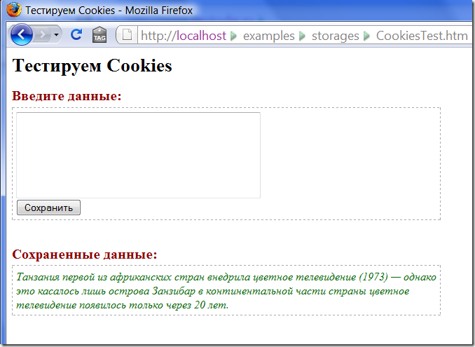
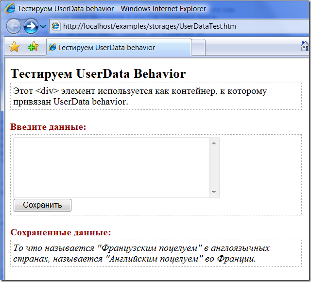
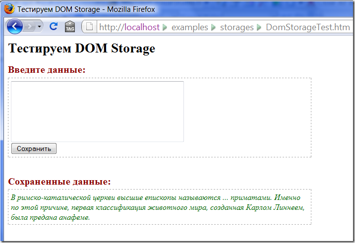

Как сохранить информацию на клиенте. Часть 1.
=============================================

        published: 2009-02-27 
        tags: ie,javascript,firefox
        permalink: https://andir-notes.blogspot.com/2009/02/howto-save-information-on-client-part-1.html

В этой заметке рассматриваются способы сохранения информации с помощью [Cookies](#Cookies), [Internet UserData Behavior](#IEUserData), [DOM Storage](#DOMStorage).

#### Введение

Количество веб-приложений растёт с немыслимой скоростью каждый день. Всё больше функциональности предоставляется пользователям прямо через браузер (а ведь это ещё недавно было прерогативой лишь только Интранет-приложений). А сами браузеры, тем временем, всё больше “стандартизируются” и пытаются [угнаться](http://www.apple.com/pr/library/2009/02/24safari.html "Apple Announces Safari 4—The World’s Fastest & Most Innovative Browser") друг за другом в скорости работы рендеринга DOM, скорости исполнения ява-скриптов (JavaScript) и оценкой при прохождении теста [ACID3](http://en.wikipedia.org/wiki/Acid3 "Wikipedia: ACID3 (en)"), и всё для того, чтобы позволить разработчикам ещё больше функциональности поместить прямо в веб-приложение, да так, чтобы пользователю было это удобно и незаметно.

Где же обычно хранят свою информацию веб-приложения?

Стандартный вариант – это, конечно же, файловая система на веб-сервере и/или база данных. При использовании асинхронных вызовов (AJAX) пользователи могут даже не знать и не замечать, что вводимая ими информация автоматически попадает на удалённый веб-сервер и сохраняется в виде записи в базе данных веб-приложения.

Что же это получается?

На сервере веб-приложения сохраняется большой набор персонифицированной информации (то есть связанной с конкретным человеком). И счастливый пользователь с любого компьютера в мире подключенного к Интернет может получить к ней доступ и внести в неё изменения (порой даже не осознавая этого).

**А что если надо сохранить информацию на клиентском компьютере?**

На сегодняшний день, благодаря, большим компаниям, появилось множество вариантов как это можно сделать. Но тут предварительно надо задать ещё один вопрос: а зачем нам это может быть надо?

_Примечание: Не будем здесь вспоминать про специфику протокола HTTP и поддержку сессии пользователей, пусть это будет само-собой разумеющемся и скрытом в инфраструктуре приложений._

*   Хранение промежуточных данных, ввод которых ещё не окончен,

> При заполнении формы, возникают ошибки ввода, сбои веб-приложения, обрывы соединений, перерывы в работе, случайные нажатия кнопок – чтобы не потерять работу, проделанную пользователем, хотелось бы сохранить её и позволить пользователю продолжать даже при критических сбоях.

*   Хранение персонифицированной информации для анонимного пользователя,

> Пользователь не предоставляет веб-приложению никакой информации о себе и, соответственно, приложению не получится сохранить данные и связать их с конкретным пользователем. Зато сам анонимный пользователь сможет сохранять свои настройки, предпочтения, делать выбор товаров и т.п.

*   Возможность приложения работать в режиме Offline,

> Если работа с приложением может быть достаточно долгой, то можно отключиться от сети и продолжать работать с приложением. А при следующем подключении, приложение определит все произведённые изменения и сохранит их на сервере.
> 
> Это может быть особенно удобным в мобильной среде, когда начать работать над документом можно возле одной точки Wi-Fi в гостинице, а закончить возле другой в аэропорту.

На этом ответов, думаю, хватит, так как вариантов необходимости сохранения некоторой информации на клиенте можно придумать множество. Пора рассмотреть технологии, которые позволяют нам это делать.

#### Http Cookies

Начнём, конечно, с самого древнего и испытанного средства: “[печеньки](http://en.wikipedia.org/wiki/HTTP_cookie "Wikipedia: HTTP Cookie (en)")”.

| | |
| -------- | --------------------- |
| Браузеры | все существующие, поддерживают в той или иной мере. |
| Макс. объём | 4 \* 50 KiB (4 KiB в IE) для одного домена |
| Безопасность | Данные привязаны к домену, или даже к определённому пути на сайте. |

Они представляют собой, в общем случае, строку из соединённых последовательно наборов типа ключ-значение, которые привязаны к определённому доменному имени:

```
param1=value1&param2=value2&param3=value3
```

Http Cookies передаются браузером при каждом запросе от пользователя к серверу с помощью http-заголовка “Cookies”. Выглядит это, примерно, так:

```
GET /index.html HTTP/1.1
 HOST: example.org
 Cookie: support=yes&value=1
```

Хранятся Cookies по-разному, в зависимости от реализации в браузере. Например, в Mozilla Firefox 3.0 они хранятся в специальной базе данных cookies.sqlite, а в Internet Explorer 7.0 используется отдельный набор файлов, по одному на доменное имя (Host).

Вот как выглядит содержимое файла  c сохранённой кукой для Internet Explorer:

```
MyNote  
This%20is%20IE%20cookie!  
localhost/examples/storages/  
1088  
1746404352  
29989188  
110582720  
29989180  
*
```

Чтобы управлять куками прямо в браузере, без необходимости делать раунд-трип на сервер, в объектной модели DOM существует свойство **document.cookie**, которое позволяет как получать значения всех установленных кукиз, так и добавлять/удалять их.

В качестве примера использования, реализуем небольшое приложение, которое будет сохранять некоторый текст в cookie с именем “MyNote”:

**CookiesTest.htm**
``` html
<html>
<head>
    <title>Тестируем Cookies</title>
    <style type="text/css">
    /* headings */
    h1, h2 { margin-bottom: 4px; }
    h1 { font-size: 16pt; }
    h2 { font-size: 12pt; color: darkred; }
    /* element styles */
    div
    {
        width: 600px;
        border: 1px dashed darkgray;
        padding: 5px;
    }
    #data
    {
        font-style: italic;
    }
    .normal { color: darkgreen; }
    .empty { color: gray; }
    </style>
    <script type="text/javascript">
    // UI utilities
    $ = function(id) { return document.getElementById(id); }
    if (window.attachEvent)
    {
        window.addEventListener = function(eventName, func, args)
        {
            window.attachEvent('on' + eventName, function() { func(window.event, args); })
        }
    }

    // cookies utilities
    getCookies = function()
    {
        var cookies = {};

        var items = document.cookie.split("; ");
        for (var ii = 0; ii < items.length; ii++)
        {
            var keyValuePair = items[ii].split("=");
            cookies[keyValuePair[0]] = decodeURIComponent(keyValuePair[1]);
        }

        return cookies;
    }

    setCookie = function(key, value, expires)
    {
        document.cookie =
            key + "=" + (value ? encodeURIComponent(value) : "")
                + ";expires=" + expires.toGMTString();
    }

    // main
    var storageKey = "MyNote";

    function TryLoadData()
    {
        var data = $("data");

        var cookies = getCookies();
        
        var value = cookies[storageKey];
        if (value != null)
        {
            data.className = "normal";
            data.innerHTML = value;
        }
        else
        {
            data.className = "empty";
            data.innerHTML = "(пусто)";
        }
    }

    function Window_Load()
    {
        TryLoadData();
    }

    function Save_Click()
    {
        var t = $("textbox"); 

        var dt = new Date();
        dt.setHours(dt.getHours() + 1);

        setCookie(storageKey, t.value, dt);

        TryLoadData();
    }

    window.addEventListener("load", Window_Load, null);
    </script>
</head>
<body>
    <h1>Тестируем Cookies</h1>
    <h2>Введите данные:</h2>
    <div>
        <textarea id="textbox" rows="6" cols="40"></textarea>
        <br />
        <input type="button" value="Сохранить" onclick="Save_Click()" />
    </div>
    <br />
    <h2>Сохраненные данные:</h2>
    <div id="data"></div>
</body>
</html>
```

Теперь, если запустить получившееся приложение, то получится:



На сегодняшний день, практически все браузеры позволяют сохранить в куках до 50 различных записей, объёмом до 4 килобайт каждая.

Где читать далее:

*   Wikipedia: [Http cookie](http://en.wikipedia.org/wiki/HTTP_cookie "Wikipedia: Http cookie (en)"),
*   MSDN: [document.cookie Property](http://msdn.microsoft.com/en-us/library/ms533693(VS.85).aspx "MSDN: document.cookie Property"),
*   Mozilla: [document.cookie](https://developer.mozilla.org/en/DOM/document.cookie "developer.mozilla.org: document.cookie"),
*   IEBlog: [Update to Internet Explorer's Cookie Jar](http://blogs.msdn.com/ie/archive/2007/08/29/update-to-internet-explorer-s-cookie-jar.aspx "IEBlog: Update to Internet Explorer's Cookie Jar").

#### Internet Explorer UserData Behavior

| | |
| ---- | --- |
| Браузеры | Только Internet Explorer |
| Макс. объём | 640-1024 KiB для одного домена |
| Безопасность | Данные привязаны к домену, на котором находится страница. |

Ещё один, довольно старый механизм сохранения данных у пользователя, это предопределённый behavior в браузере Internet Explorer.

_Примечание: Если вы пользуетесь локально установленным MSDN, то знайте, что он сохраняет свои установки (фильтры по языку, технологии) именно с помощью UserData._

Представляют собой также наборы в виде ключ-значение, которые затем сохраняются в виде кусочка XML. Само содержимое хранится в папке \[_%APPDATA%\\Microsoft\\Internet Explorer\\UserData_\].

Реализуем пример, который сохраняет данные в этом виде хранилища.

**UserDataTest.htm**

``` html
<html>
<head>
    <title>Тестируем UserData behavior</title>
    <style type="text/css">
    /* headings */
    h1, h2 { margin-bottom: 4px; }
    h1 { font-size: 16pt; }
    h2 { font-size: 12pt; color: darkred; }
    /* behavior */
    #storage { behavior: url(#default#userData); }
    /* element styles */
    div
    {
        width: 600px;
        border: 1px dashed darkgray;
        padding: 5px;
    }
    #area
    {
        border: 1px dashed darkgray;
    }
    #data
    {
        font-style: italic;
    }
    .normal { color: black; }
    .empty { color: gray; }
    </style>

    <script type="text/javascript">
    // UI utilities
    $ = function(id) { return document.getElementById(id); }
    if (window.attachEvent)
    {
        window.addEventListener = function(eventName, func, args)
        {
            window.attachEvent('on' + eventName, function() { func(window.event, args); });
        }
    }

    // main
    var storageName = "Home.Examples.Andir";
    var storageKey = "MyNote";
 
    function TryLoadData()
    {
        var s = $("storage");
        var data = $("data");
        s.load(storageName);

        var attr = s.getAttribute(storageKey);
        if (attr != null && attr != '')
        {
            data.className = "normal";
            data.innerHTML = attr;
        }
        else
        {
            data.className = "empty";
            data.innerHTML = "(пусто)";
        }
    }

    function Window_Load()
    {
        TryLoadData();
    }

    function Save_Click()
    {
        var s = $("storage");
        var t = $("textbox");

        s.setAttribute(storageKey, t.value);
        s.save(storageName);

        TryLoadData();
    }

    window.addEventListener("load", Window_Load, null);
    </script>
</head>
<body>
    <h1>Тестируем UserData Behavior</h1>
    <div id="storage">Этот &lt;div&gt; элемент используется
        как контейнер, к которому привязан UserData behavior.</div>
    <h2>Введите данные:</h2>
    <div class="area">
        <textarea id="textbox" rows="6" cols="40"></textarea>
        <br />
        <input type="button" value="Сохранить" onclick="Save_Click()" />
    </div>
    <br />
    <h2>Сохраненные данные:</h2>
    <div id="data"></div>
</body>
</html>
```

Запускаем:



Заглянем туда, где сохраняются данные UserData, и там среди папок со случайными именами (которые на самом деле привязаны к домену) можно найти файл **Home.Examples\[1\].xml** со следующим содержимым:

``` xml
<ROOTSTUB MyNote="То что называется &quot;Французским поцелуем&quot; в англоязычных странах, называется &quot;Английским поцелуем&quot; во Франции."/>
``` 

Вот в таком виде и хранятся все данные использующие UserData behavior.

Где читать далее:

*   MSDN: [userData Behavior](http://msdn.microsoft.com/en-us/library/ms531424(VS.85).aspx "MSDN: userData Behavior").

#### DOM Storage

Среди новостей об активных разработках в области web-стандартов за последнее время уже не раз то и дело мелькает [HTML5](http://www.whatwg.org/specs/web-apps/current-work/multipage/ "WhatWG: HTML 5") от WhatWG (Web Hypertext Application Technology Working Group), который ранее был известен под названием Web Applications 1.0. Первый черновик стандарта был опубликован в январе прошлого года (2008).

_Примечание: последний опубликованный стандарт HTML 4.01 в последний раз редактировался в 1999 году._

Не будем углубляться в сам стандарт, рассмотрим только один его раздел: [Structured Client-Side Storage](http://www.whatwg.org/specs/web-apps/current-work/multipage/structured-client-side-storage.html#structured-client-side-storage "HTML 5: Structured Client-Side Storage").

Несмотря на то, что на сегодняшний день существует только черновик стандарта, но часть про структурированное хранилище на клиентской стороне уже реализована в нескольких браузерах.

| | |
| --- | --- |
| Браузеры | Firefox 2.0+, Internet Explorer 8.0, Safari |
| Макс. объём | 5 MiB для одного домена |
| Безопасность | Данные привязаны к домену, на котором находится страница. |

Прочитав указанную часть стандарта можно узнать, о том, что существует интерфейс Storage с методами getItem, setItem, removeItem. Реализации этого интерфейса представляются объектами localStorage и sessionStorage.

По сути Storage очень похож на механизм Cookies, за исключением того, что объём данных гораздо менее ограничен и нет привязки к HTTP-протоколу.

На сегодняшний день, в браузере Mozilla Firefox 3 реализован вариант sessionStorage. Данные при этом хранятся на время пользовательской сессии в браузере и после уничтожаются.

Посмотрим на это хранилище в действии:

**DomStorageTest.htm**

``` html
<html>
<head>
    <title>Тестируем DOM Storage</title>
    <style type="text/css">
    /* headings */
    h1, h2 { margin-bottom: 4px; }
    h1 { font-size: 16pt; }
    h2 { font-size: 12pt; color: darkred; }
    /* behavior */
    #storage { behavior: url(#default#userData); }
    /* element styles */
    div
    {
        width: 600px;
        border: 1px dashed darkgray;
        padding: 5px;
    }
    #area
    {
        border: 1px dashed darkgray;
    }
    #data
    {
        font-style: italic;
    }
    .normal { color: black; }
    .empty { color: gray; }
    </style>

    <script type="text/javascript">
    // UI utilities
    $ = function(id) { return document.getElementById(id); }
    if (window.attachEvent)
    {
        window.addEventListener = function(eventName, func, args)
        {
            window.attachEvent('on' + eventName, function() { func(window.event, args); });
        }
    }

    // main
    var storageKey = "MyNote";

    function TryLoadData()
    {
        var s = window.sessionStorage;
        var data = $("data");

        var attr = s[storageKey];
        if (attr != null && attr != '')
        {
            data.className = "normal";
            data.innerHTML = attr;
        }
        else
        {
            data.className = "empty";
            data.innerHTML = "(пусто)";
        }
    }

    function Window_Load()
    {
        TryLoadData();
    }

    function Save_Click()
    {
        var s = window.sessionStorage;
        var t = $("textbox");

        s[storageKey] = t.value;
        TryLoadData();
    }

    window.addEventListener("load", Window_Load, null);
    </script>
</head>
<body>
    <h1>Тестируем DOM Storage</h1>
    <h2>Введите данные:</h2>
    <div class="area">
        <textarea id="textbox" rows="6" cols="40"></textarea>
        <br />
        <input type="button" value="Сохранить" onclick="Save_Click()" />
    </div>
    <br />
    <h2>Сохраненные данные:</h2>
    <div id="data"></div>
</body>
</html>
```

Запускаем:



Если закрыть окно, то сохранённые данные, к сожалению, удалятся. Чтобы сохранить данные дольше, чем на время браузерной сессии, то в Firefox 3.0 нужно использовать объект globalStoragе, который хранит данные неограниченно долго и также реализует интерфейс Storage.

_Примечание: Данные помещённые в globalStorage браузера Firefox сохраняются в базе данных webappsstore.sqlite._

Где читать далее:

*   Mozilla: [DOM Storage](https://developer.mozilla.org/En/DOM/Storage "Mozilla: DOM Storage"),
*   John Resig: [DOM Storage](http://ejohn.org/blog/dom-storage/ "John Resig: DOM Storage").

_Продолжение следует … (Google Gears, Silverlight Isolated Storage, Adobe Flash Storage)._