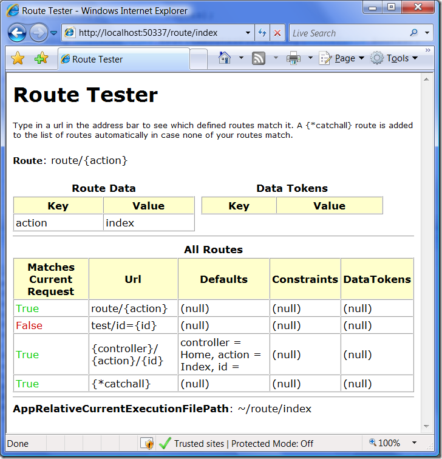

Отладка маршрутов для System.Web.Routing
========================================

    published: 2009-02-27 
    tags: system.web.routing,tools,asp.net 
    permalink: https://andir-notes.blogspot.com/2009/02/systemwebrouting_27.html

В глубинах интернета обнаружился интересный инструмент [“Url Routing Debugger”](http://haacked.com/archive/2008/03/13/url-routing-debugger.aspx "Haacked: ASP.NET Routing Debugger"), предназначенный для отладки маршрутов задаваемых с помощью _System.Web.Routing_.

Достаточно добавить RouteDebug.dll в референсы проекта, и прописать в **Global.asax** сразу после регистрации маршрутов следущий код:

``` cs
using System;
using System.Web.Routing;

namespace Home.Andir.Examples
{
    public class Global : System.Web.HttpApplication
    {
        protected void Application_Start(object sender, EventArgs e)
        {
            RegisterRoutes(RouteTable.Routes);

            RouteDebug.RouteDebugger.RewriteRoutesForTesting(RouteTable.Routes);
        }

        private void RegisterRoutes(RouteCollection routes)
        {
            routes.Add(
                new Route(
                    "route/{action}",
                    new StopRoutingHandler())
                );

            routes.Add(
                new Route(
                    "test/id={id}",
                    new StopRoutingHandler())
                );

            routes.Add(
                new Route(
                    "{controller}/{action}/{id}",
                    new RouteValueDictionary {
                        { "controller", "Home" },
                        { "action", "Index" },
                        { "id", "" } },
                    new StopRoutingHandler())
                );
        }
    }
}
```

Отладчик, подменяет все заданные **IRouteHandler** на свой **DebugRouteHandler** и теперь, если перейти на любой заданный маршрут, то можно увидеть следующую картину:

 

Здесь можно увидеть список всех зарегистрированных маршрутов и порядок их срабатывания (в первой колонке).