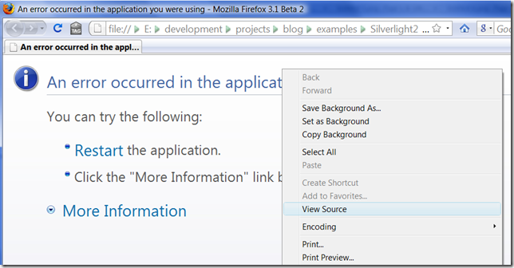

Интересный эффект Silverlight-плеера в Firefox
==============================================

        published: 2009-02-28 
        tags: ie,firefox,silverlight 
        permalink: https://andir-notes.blogspot.com/2009/02/blog-post.html

Если создать пустой xaml-файл и открыть его в Firefox 3, то можно, с удивлением, увидеть …:

как внутри окна откроется Internet Explorer 7 :-). Ай да, Microsoft!