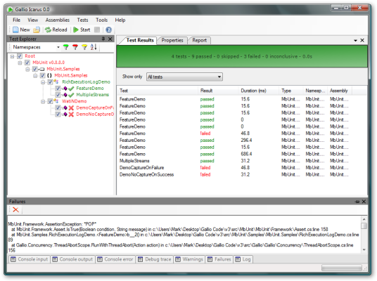

Gallio – платформа для автоматизации юнит-тестов
================================================

    published: 2009-03-03 
    tags: .net, tdd 
    permalink: https://andir-notes.blogspot.com/2009/03/test-automation-platform-gallio.html

Набрёл на [проект](http://www.gallio.org/) посвященный созданию универсальной платформы для юнит-тестирования.

Основная идея состоит в том, что по сути многие фреймворки для юнит-тестирования (NUnit, xUnit, csUnit, MbUnit, MS Test и т.п.) очень похожи между собой, и можно попробовать выделить общую часть, касающуюся запуска и анализа результатов юнит-тестов, в отдельный легко расширяемый набор сервисов и инструментов.

Текущий статус проекта неясно описан, но в данный момент уже есть несколько релизов и даже пара инструментов, среди которых: красивый GUI-tool для запуска тестов **Gallio.Icarus:**

 

Интересно, что название проекта Gallio – это в действительности Gallileo написанное с двумя пропущенными буквами.