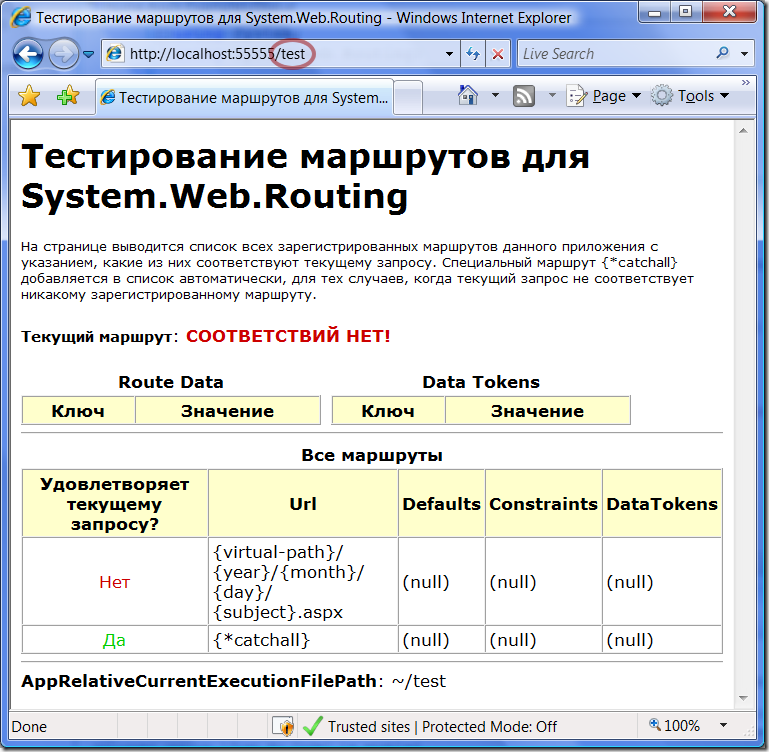
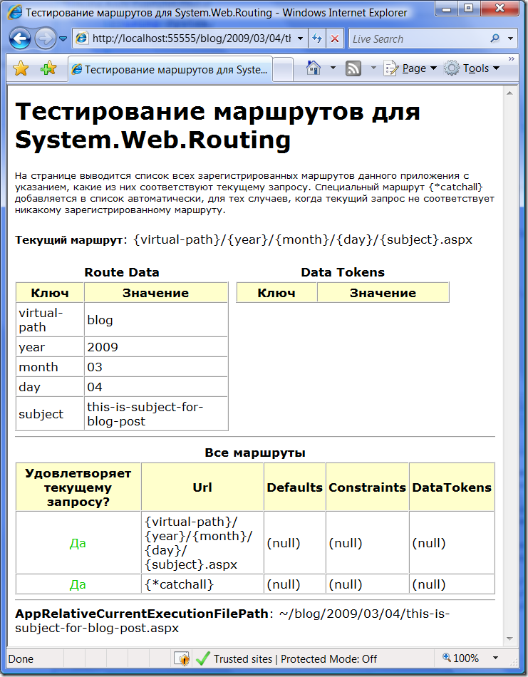

System.Web.Routing: Route, Defaults, Constraints, Data Tokens
=============================================================

published: 2009-03-04 
tags: system.web.routing,asp.net, 
permalink: https://andir-notes.blogspot.com/2009/03/systemwebrouting-route-defaults.html

[Продолжаем](http://andir-notes.blogspot.com/search/label/system.web.routing "Andir: Label: system.web.routing") обзор возможностей **System.Web.Routing**. Эта заметка будет очень небольшая в связи с тем, что функциональность, в принципе, вполне самоочевидная и простая.

#### Route

Как известно, основной реализацией **RouteBase** в библиотеке является класс **Route**, который реализует вариант маршрутизации с разделением адреса запроса на именованные сегменты. Суть этого всего на самом деле очень простая, но при этом внутри спрятана достаточно мощная семантика.

_Примечание: Сегментами URL называются части, которые отделяются знаком “/”, соответственно сегмент не может содержать этого знака. В .Net все сегменты Url можно получить с помощью метода Uri.Segments._

Итак, рассмотрим произвольный до степени достоверности Url в типичном ASP.Net приложении подверженном операции реврайтинга (url rewriting), пусть это будет виртуальный блог неизвестного автора:

```
http://example.org/blog/2009/03/04/this-is-very-smart-subject-for-best-blog-post.aspx 
```

Разобьем этот адрес на самоочевидные логические сегменты, например так:

```
http://example.org/{virtual-path}/{year}/{month}/{day}/{subject}.aspx
```

и заметим, что собственно, всё что нам надо – это получить значения этих логических сегментов и передать гипотетическому хэндлеру ASP.Net, который в ответ сможет отрендерить HTML-код c текстом сообщения из блога под именем {blog} за указанное число {day}.{month}.{year} с указанной темой {subject}. 

В общем-то, после такого разбиения Url уже фактически готов к тому, чтобы стать некоторым маршрутом зарегистрированным в глобальной таблице маршрутов приложения:

``` cs
using System;
using System.Web.Routing;

namespace Home.Andir.Examples
{
    public class Global : System.Web.HttpApplication
    {
        protected void Application_Start(object sender, EventArgs e)
        {
            RegisterRoutes(RouteTable.Routes);

            RouteDebug.RouteDebugger.RewriteRoutesForTesting(RouteTable.Routes);
        } 

        private void RegisterRoutes(RouteCollection routes)
        {
            routes.Add(
                new Route(
                    "{virtual-path}/{year}/{month}/{day}/{subject}.aspx",
                    new StopRoutingHandler()));
        }
    }
}
```

Ну вот, теперь в приложении есть ровно один зарегистрированный маршрут. Можно его протестировать.

_Примечание: Для удобного тестирования маршрутов я использую RouteDebug.dll про которую я писал в_ [_недавней заметке_](http://andir-notes.blogspot.com/2009/02/systemwebrouting_27.html "Andir: Отладка маршрутов для System.Web.Routing")_. Плюс я дополнительно русифицировал результирующую страничку._

__

На скриншоте хорошо видно, что маршрут успешно зарегистрирован, но введёному запросу “_~/test”_ не удовлетворяет.

Как уже собственно понятно, именованые сегменты Url играют роль подстановочных переменных, которые затем передаются результирующему хендлеру в виде словаря **RouteData**.

Теперь введём Url, который удовлетворяет нашему маршруту и пронаблюдаем как заполняется словарь RouteData при этом:



Всё прошло хорошо.

#### Параметры

Как можно разглядеть на скриншотах и в параметрах класса **Route**, в каждом маршруте опционально могут присутствовать некие Defaults, Constraints и Data Tokens. Обсудим их подробнее.

**Defaults** – значения подстановочных переменных по умолчанию, позволяют задать опциональные сегменты Url, которые должны находится в конце текущего Url. Например, для такого маршрута:

``` cs
routes.Add(
    new Route(
        "{street}/{building}/{flat}",
        new RouteValueDictionary { { "flat", "1" } },
        new StopRoutingHandler()));
```

Будут соответствовать такие запросы:

```
~/svetlanskaya/15/5/ – { { “street”, “svetlanskaya”}, { “building”, “15” }, { “flat”, “5” } }
 ~/aleutskaya/46/     - { { “street”, “aleutskaya”}, { “building”, “46” }, { “flat”, “1” } }
```

и при этом во втором случае, так как не задан сегмент для номера квартиры (flat), то будет использоваться значение по умолчанию.

**Constraints** – ограничения на значения подстановочных переменных, и если значения не удовлетворяют этим ограничениям, то маршрут не срабатывает. Представляют собой обыкновенные регулярные выражения, и если значение подстановочной переменной не удовлетворяет регулярному выражению, то маршрут считается недействительным.

Рассмотрим ограничения на первоначальном примере. Пусть нам необходимо ограничить значения для года, месяца и дня так, чтобы в них могли попадать более-менее реальные значения (только цифры, год больше 2000, месяц меньше 12, день меньше 31).

Модифицируем маршрут так:

``` cs
routes.Add(
    new Route(
        "{virtual-path}/{year}/{month}/{day}/{subject}.aspx",
        null,
        new RouteValueDictionary {
            { "year", @"2\\d{3}" },
            { "month", @"(0\\d|11|12)" },
            { "day", @"(0\\d|1\\d|2\\d|30|31)" }
        },
        new StopRoutingHandler()));
```

Полученные ограничения позволяют только маршруты, в которых корректно (почти) задана дата, а для остальных вариантов можно задать будет дополнительный маршрут.

Проверка для маршрута показывает:

```
~/blog/2009/03/04/this-is-subject-for-blog-post.aspx - соответствует,
~/blog/2009/33/44/this-is-subject-for-blog-post.aspx - не соответствует,
~/blog/1999/03/04/this-is-subject-for-blog-post.aspx - не соответствует.
```

**Data Tokens** – набор дополнительных параметров для маршрута. Позволяет передать хендлеру, зарегистрированному для данного маршрута ещё какие-нибудь произвольные данные.

Интересное и показательное использование Data Tokens придумать у меня не получилось, поэтому оставляю пока здесь место для читательской фантазии ;-).

#### Catch-all сегменты

А ещё маршруты можно указывать так:

``` cs
routes.Add(
    new Route(
        "route/{\*all}",
        new StopRoutingHandler()));
```

Это случай так называемых catch-all сегментов. Такие сегменты могут появляться только последними в регистрируемом маршруте, но зато они при этом соответствуют произвольному окончанию данного маршрута.

```
~/route/test/ - соответствует, и при этом {"all", "test/"}
~/route/segment1/segment2/?id=1 - соответствует и при этом {"all", "segment1/segment2/"} 
```

Единственное, что может остановить сatch-all сегмент – это ограничения (Constraints), заданные на значение параметра.

Например:

``` cs
routes.Add(
    new Route(
        "{\*allaspxpages}",
        null,
        new RouteValueDictionary { { "allaspxpages", @".+\\.aspx" } },
        new StopRoutingHandler()));
```

Такой маршрут будет срабатывать только для запросов к несуществующим aspx-страницам.

#### Для информации

Q: Что будет, если маршрут будет соответствовать некоторому существующему на диске файлу?

A: Текущий движок **UrlRoutingModule** запросы соответствующие физическому пути к существующему файлу по умолчанию не обрабатывает! В ответ на запрос будет возвращён соответствующий файл. Чтобы изменить это поведение, нужно смотреть в сторону **RouteTable**._RouteExistingFiles_.

Q: А если это будет виртуальный путь, но закреплённый за каким-нибудь **IHttpHandler** ?

A: Приоритет окажется в руках у **UrlRoutingModule**, и если окажется зарегистрированным маршрут соотвествующий запросу к зарегистрированному **IHttpHandler**, то запрос до него не дойдёт. Поэтому надо явно прописывать игнорирование маршрутов до вашего хендлера с помощью метода _IgnoreRoute_.