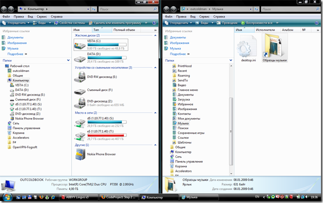

Управление окнами с клавиатуры также как в Windows 7 и даже больше
==================================================================

    published: 2009-04-24 
    tags: .net,tools 
    permalink: https://andir-notes.blogspot.com/2009/04/vista-like-windows-management.html

Более полугода назад я стал обладателем хорошего широкого прямоугольного монитора LG W2600HP и избавился от надоевших квадратов, по крайней мере, дома.

Сразу же у меня обнаружилась скверная привычка открывать все окна на весь экран. Для широкого монитора это достаточно неудобно, особенно при работе с текстом: глаза разбегаются и приходится вертеть головой во время чтения. Поэтому пришлось отучиваться от этой привычки: подгонять вручную окна под определённый размер и располагать их примерно в середине экрана.

А недавно обнаружил прекрасную утилиту [keysextender](http://code.google.com/p/keysextender/ "code.google.com: keysextender") от [outcoldman](http://outcoldman.habrahabr.ru/blog/57669/), для управления окнами с помощью горячих клавиш Win + \[Right|Up|Left|Down\].

Win + Up – максимизация текущего окна,

Win + Down – минимизация текущего окна, или восстановление максимизированного,

Win + Right – поместить на полэкрана справа,

Win + Left – поместить на полэкрана слева.

Отличная, в общем, утилита, за исключением мигающего окошка при старте.

#### Двойная максимизация

С её помощью я решил автоматизировать управление окнами на своём мониторе, и реализовать дополнительную функцию двойной максимизации. Это когда по первому нажатию Win + Up не сразу максимизирует окно, а вначале помещает его определённый размер, а по второму делает честную максимизацию.

Так как проект Open Source, то сделать это не составило никакого труда и стоило пару часов кодирования и отладки.

Результат:

Binary: [keysextender\_withdoublemaximize\_bin.zip](http://sites.google.com/site/andirnotes/blogfiles/keysextender_withdoublemaximize_bin.zip?attredirects=0),

Source: [keysextender\_withdoublemaximize\_src.zip](http://sites.google.com/site/andirnotes/blogfiles/keysextender_withdoublemaximize_src.zip?attredirects=0).

Патч отправлен автору и, возможно, фича попадёт в основную ветку проекта.