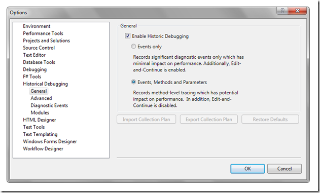

Visual Studio 2010 – Historical Debugger
========================================

    published: 2009-08-11 
    tags: debug,tools,visual studio, 
    permalink: https://andir-notes.blogspot.com/2009/08/visual-studio-2010-historical-debugger.html

Случайно посмотрел PodCast про новую фенечку в Visual Studio 2010. Это так называемый Historical Debugger ("Исторический отладчик").

На мой первый взгляд – весьма примечательная и полезная вещь.

[**MSDN 9 Channel: An Introduction to the Historical Debugger**](http://channel9.msdn.com/shows/10-4/10-4-Episode-28-An-Introduction-to-the-Historical-Debugger/)

_Замечание: Ну и быстро говорит этот товарищ!_

По сути, что там происходит: система записывает (Trace) состояние приложения в контрольных точках (события, исключения и т.п.) и затем позволяет разработчику во время отладки воспроизвести выполнение приложения по шагам. Это, предположительно, позволяет упростить отладку в особо сложных случаях (например, когда ошибка возникает только у пользователей в их специфичных условиях работы). Словом, это такой способ воспроизведения ошибок, когда нет необходимости воспроизведения условий их возникновения.

А для продвинутых пользователей (тестеров и самих разработчиков) появится возможность приложить "Лог исполнения" (Execution Log) к описанию ошибки в багтрекере. Затем разработчик ответственный за исправление ошибки сможет использовать этот лог для быстрой диагностики ошибки и её исправления.

**Настройки в VS:**

****

**Новая вкладка**:

 

Подробнее о новом отладчике можно прочитать:

*   [IanWho: Historical Debugging in Visual Studio Team System 2010](http://blogs.msdn.com/ianhu/archive/2009/05/13/historical-debugging-in-visual-studio-team-system-2010.aspx),
*   [John Robbins (Wintellect): How Does VS2010 Historical Debugging Work?](http://www.wintellect.com/CS/blogs/jrobbins/archive/2009/06/16/how-does-vs2010-historical-debugging-work.aspx)