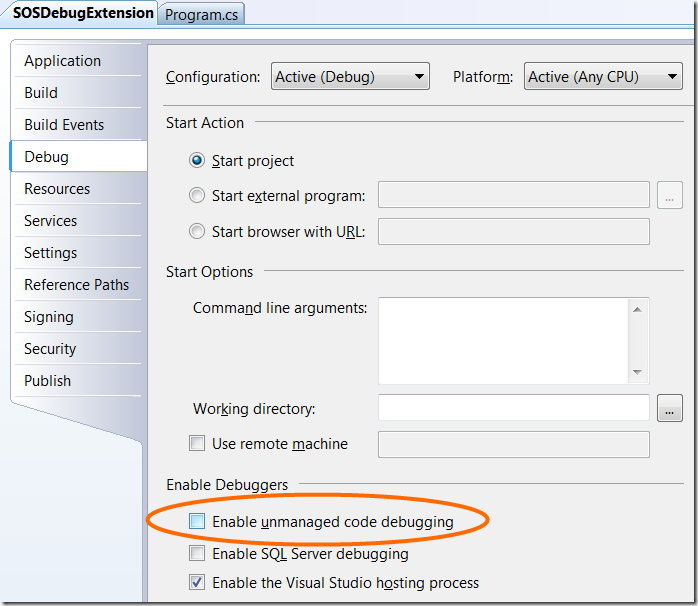
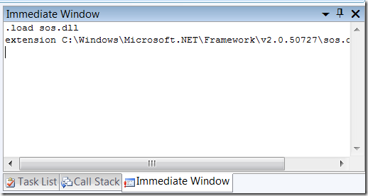

Расширение отладчика SOS для Visual Studio 2008
===============================================

    published: 2009-08-14 
    tags: .net,debug,visual studio 
    permalink: https://andir-notes.blogspot.com/2009/08/sos-debugging-extension-for-vs2008.html

Много раз во время отладки приложений, мне хотелось получать гораздо больше информации от отладчика, о том как расположены мои объекты в памяти, сколько занимают места, как давно созданы и сколько их существует. Обычно, такое нужно, когда хочется составить более полное представление о том, как работает программа.

Так вот, оказывается существует специальное расширение для отладчиков Visual Studio и WinDbg, которое поставляется вместе с .Net Framework. Это расширение и называется SOS и находится в %SystemRoot%\\Microsoft.Net\\v2.0.50727\\sos.dll для CLR 2.0.

_Примечание: SOS расшифровывается как Son Of Strike._

Продемонстрирую работу с этим расширением и заодно покажу в действии набор команд, которые в нём существуют.

Итак, первое. Реализуем небольшой пример:

``` cs
using System;

namespace Home.Andir.Examples
{
    class A
    {
        public uint Value { get; set; }

        public override string ToString()
        {
            return string.Format("A {{ Value = 0x{0:x} }}", Value);
        }
    }

    class Program
    {
        static void Main(string[] args)
        {
            TestSOSMethod(
                "Hello debugging world!");
        }

        private static void TestSOSMethod(string ignoreThis)
        {
            var a = new A() { Value = 0xDEADBEEF };
            var b = new A() { Value = 0xBEEFDEAD };

            Console.WriteLine("a = {0}, b = {1}", a, b);
            Console.ReadKey(); // breakpoint is here
        }
    }
}
```

В примере, вызывается метод с одним параметром и создаются два объекта типа **Home.Andir.Examples.A** с магическими числами, которые потом будет хорошо видно в отладчике.

Теперь, чтобы можно было воспользоваться возможностями SOS, нужно включить в свойствах проекта неуправляемую отладку.



Теперь, устанавливаем точку остановки (Breakpoint) в статическом методе TestSOSMethod на строке Console.ReadKey(). И запускаем в режиме отладки (F5).

В консоли будет выведено:

``` cs
a = A { Value = 0xdeadbeef }, b = A { Value = 0xbeefdead }
```

Впрочем, как и ожидалось. Теперь загрузим sos.dll, для этого нужно открыть окно Immediate (Debug –> Windows –> Immediate) и написать первой командой **.load sos.dll**:

 

В окне выведено:

``` cs
.load sos.dll
  extension C:\\Windows\\Microsoft.NET\\Framework\\v2.0.50727\\sos.dll loaded
```

Отлично! SOS успешно загрузился, и теперь можно поэкспериментировать с его командами.

Начнём, как обычно с help.

``` 
!help
  -------------------------------------------------------------------------------
  SOS is a debugger extension DLL designed to aid in the debugging of managed
  programs. Functions are listed by category, then roughly in order of
  importance. Shortcut names for popular functions are listed in parenthesis.
  Type "!help <functionname>" for detailed info on that function. 
  
  Object Inspection                  Examining code and stacks
  -----------------------------      -----------------------------
  DumpObj (do)                       Threads
  DumpArray (da)                     CLRStack
  DumpStackObjects (dso)             IP2MD
  DumpHeap                           U
  DumpVC                             DumpStack
  GCRoot                             EEStack
  ObjSize                            GCInfo
  FinalizeQueue                      EHInfo
  PrintException (pe)                COMState
  TraverseHeap                       BPMD 
  
  Examining CLR data structures      Diagnostic Utilities
  -----------------------------      -----------------------------
  DumpDomain                         VerifyHeap
  EEHeap                             DumpLog
  Name2EE                            FindAppDomain
  SyncBlk                            SaveModule
  DumpMT                             GCHandles
  DumpClass                          GCHandleLeaks
  DumpMD                             VMMap
  Token2EE                           VMStat
  EEVersion                          ProcInfo 
  DumpModule                         StopOnException (soe)
  ThreadPool                         MinidumpMode 
  DumpAssembly                       
  DumpMethodSig                      Other
  DumpRuntimeTypes                   -----------------------------
  DumpSig                            FAQ
  RCWCleanupList
  DumpIL
```

Как видим, функций довольно много, и названия у них вполне себе говорящие. Подробнее о каждой функции можно узнать, если набрать !help <имя команды>.

_Примечание: В дальнейшем, вывод команды !help <имя команды> будет показываться в урезанном виде, чтобы исключить неважные в данном случае детали. Для подробного описания команды используйте MSDN или самостоятельно вызывайте эту команду._

Продолжим с нашим примером. Изучим команду clrstack, которая как очевидно из названия может инспектировать содержимое стека текущего потока.

```
!help clrstack
  -------------------------------------------------------------------------------
  !CLRStack [-a] [-l] [-p]
  
  CLRStack attempts to provide a true stack trace for managed code only. It is
  handy for clean, simple traces when debugging straightforward managed 
  programs. The -p parameter will show arguments to the managed function. The 
  -l parameter can be used to show information on local variables in a frame.
  SOS can't retrieve local names at this time, so the output for locals is in
  the format <local address> = <value\>. The -a (all) parameter is a short\-cut
  for -l and -p combined.
```

Сейчас мы находимся внутри метода TestSOSMethod и можно посмотреть, что находится в данный момент в стеке текущего потока.

```
!clrstack -a
  OS Thread Id: 0x1984 (6532)
  ESP       EIP     
  0012ec2c 013b0178 Home.Andir.Examples.Program.TestSOSMethod(System.String)
      PARAMETERS:
          ignoreThis = 0x01a09290
      LOCALS:
          0x0012ec4c = 0x01a09304
          0x0012ec48 = 0x01a09310
          0x0012ec44 = 0x01a09304
          0x0012ec40 = 0x01a09310
  
  0012ec94 013b00a0 Home.Andir.Examples.Program.Main(System.String[])
      PARAMETERS:
          args = 0x01a09280
  
  0012eef4 67971b4c [GCFrame: 0012eef4] 
```

Видим, что в стеке находится два метода и у текущего метода, есть один параметр с именем ignoreThis и четыре записи в локальных переменных с неизвестными именами (при этом объекта всего два, что видно по повторяющимся адресам). Теперь посмотрим значения этих параметров и переменных. Для начала, рассмотрим параметр ignoreThis.

Чтобы посмотреть объекты в памяти существует команда dumpobj (сокращение do) которая принимает в параметре адрес объекта.

```
!help dumpobj
  -------------------------------------------------------------------------------
  !DumpObj \[-nofields\] <object address>
  
  This command allows you to examine the fields of an object, as well as learn 
  important properties of the object such as the EEClass, the MethodTable, and 
  the size.
  
  The arguments in detail:
  -nofields:     do not print fields of the object, useful for objects like 
                    String
```

Итак, вызываем dumpobj для объект ignoreThis (используем параметр –nofields чтобы не выводить ненужные нам поля объекта string):

```
!dumpobj -nofields 0x01a09290
  Name: System.String
  MethodTable: 670d88a4
  EEClass: 66e9a498
  Size: 62(0x3e) bytes
   (C:\\Windows\\assembly\\GAC\_32\\mscorlib\\2.0.0.0__b77a5c561934e089\\mscorlib.dll)
  String: Hello debugging world!
```

Продолжаем исследовать объекты в стеке, теперь посмотрим на локальные переменные (сразу все по очереди):

```
!do 0x01a09304
  Name: Home.Andir.Examples.A
  MethodTable: 0024338c
  EEClass: 00241830
  Size: 12(0xc) bytes
   (D:\\development\\projects\\andir-notes\\examples\\SOSDebugExtension\\SOSDebugExtension\\bin\\Debug\\SOSDebugExtension.exe)
  Fields:
        MT    Field   Offset                 Type VT     Attr    Value Name
  670b9cc8  4000001        4        System.UInt32  1 instance 3735928559 <Value>k__BackingField
  
  !do 0x01a09310
  Name: Home.Andir.Examples.A
  MethodTable: 0024338c
  EEClass: 00241830
  Size: 12(0xc) bytes
   (D:\\development\\projects\\andir-notes\\examples\\SOSDebugExtension\\SOSDebugExtension\\bin\\Debug\\SOSDebugExtension.exe)
  Fields:
        MT    Field   Offset                 Type VT     Attr    Value Name
  670b9cc8  4000001        4        System.UInt32  1 instance 3203391149 <Value>k__BackingField
```

Видим два объекта в памяти типа **Home.Andir.Examples.A**, которые занимают по 12 байт и содержат ровно одно поле со странным именем _<Value>k\_\_BackingField_ и типом System.UInt32, как очевидно, которое является автоматически сгененированным полем для автосвойства _Value._

Каждый объект занимает 12 байт, а так как внутри находится только 1 поле длиной 4 байта, то получаем что оверхед равняется 8 байтам.

Ещё одна полезная команда, которая позволит убедиться, что у нас в памяти находится ровно два объекта. Это dumpheap, у которой есть параметр –type для фильтрации вывода по имени типа (всё же в хипе находится довольно много служебной информации).

```
!dumpheap -type Home.Andir.Examples.A
   Address       MT     Size
  01a09304 0024338c       12     
  01a09310 0024338c       12     
  total 2 objects
  Statistics:
        MT    Count    TotalSize Class Name
  0024338c        2           24 Home.Andir.Examples.A
  Total 2 objects
```

О том, сколько всякого мусора находится в GC Heap можно узнать с помощью этой же команды и параметра –stat.

```
!dumpheap -stat
  total 7737 objects
  Statistics:
        MT    Count    TotalSize Class Name
  670e18f0        1           12 System.Collections.Generic.GenericEqualityComparer\`1\[\[System.String, mscorlib\]\]
  670e0ba0        1           12 System.Security.Permissions.ReflectionPermission
  670df8a8        1           12 System.Resources.FastResourceComparer
  670dcd44        1           12 System.\_\_Filters
  ....
```

Теперь понятно, зачем нужна фильтрация по имени типа. На самом деле, команда dumpheap – очень мощная команда и позволяет исследовать многие параметры GC Heap (см. !help dumpheap, где есть в том числе и примеры её полноценного использования).

#### Далее

Для подробного изучения порекомендую посетить следующие ресурсы:

*   [MSDN: SOS Debugging Extension (SOS.dll)](http://msdn.microsoft.com/en-us/library/bb190764%28VS.80%29.aspx),
*   [MSDN Magazine: Bugslayer column: SOS: It's Not Just an ABBA Song Anymore](http://msdn.microsoft.com/en-us/magazine/cc164138.aspx),
*   [Eran Sandler: Advanced .NET Debugging](http://dotnetdebug.net/tag/sos/)

Также, рекомендую прочитать Success Story об удачном использовании SoS для обнаружения проблем в приложении ASP.Net: [Dan McKinley: App Server Autopsy](http://mcfunley.com/229/app-server-autopsy).