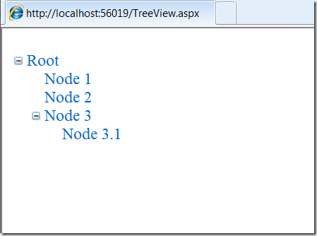
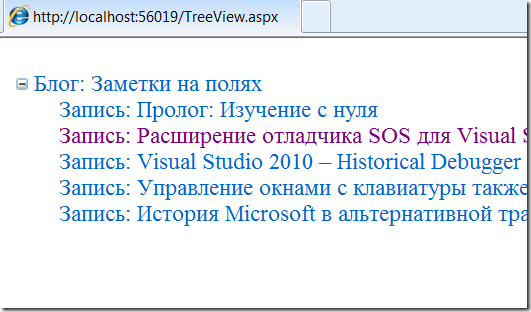

Пример декларативного биндинга asp:TreeView
===========================================

    published: 2009-09-13 
    tags: asp.net 
    permalink: https://andir-notes.blogspot.com/2009/09/asptreeview-decrarative-binding.html

Рассмотрим пример биндинга asp:TreeView к XmlDataSource.

``` xml
<%@ Page
    Language="C#"
    MasterPageFile="~/Shared/Site.Master"
    AutoEventWireup="true"
    CodeBehind="TreeView.aspx.cs"
    Inherits="Home.Andir.Examples.TreeViewPage"
    %>
<asp:Content ContentPlaceHolderID="BodyPlaceHolder" runat="server">
    <asp:TreeView ID="treeView" runat="server"
        DataSourceID="xmlDataSource">
        <DataBindings>
            <asp:TreeNodeBinding TextField="Name" />
        </DataBindings>
    </asp:TreeView>

    <asp:XmlDataSource ID="xmlDataSource" runat="server">
        <Data>
            <Root Name="Root">
                <Node Name="Node 1" />
                <Node Name="Node 2" />
                <Node Name="Node 3">
                    <Node Name="Node 3.1" />
                </Node>
            </Root>
        </Data>
    </asp:XmlDataSource>
</asp:Content>
```

И результат:

 

Как видим, биндинг вполне прямолинейный и полностью декларативный, XML-данные можно хранить прямо в разметке или подгружать из внешнего файла (с помощью свойства **DataFile**), мало того, XML можно перед биндингом трансформировать с помощью XSLT (с помощью свойства **Transform**).

#### Пример биндинга к RSS

Необходимость писать дополнительный код появляется только если требуется получать XML от какого-то внешнего источника. Например, строить по данным из БД или получать RSS-фид из интернета.

``` xml
<%@ Page
    Language="C#"
    MasterPageFile="~/Shared/Site.Master"
    AutoEventWireup="true"
    CodeBehind="TreeView.aspx.cs"
    Inherits="Home.Andir.Examples.TreeViewPage"
    %>

<asp:Content ContentPlaceHolderID="BodyPlaceHolder" runat="server">
    <asp:TreeView ID="treeView" runat="server"
        DataSourceID="feedDataSource">
        <DataBindings>
            <asp:TreeNodeBinding 
                DataMember="feed" 
                FormatString="Блог: {0}"
                TextField="title" 
                />
            <asp:TreeNodeBinding 
                DataMember="entry"
                FormatString="Запись: {0}"
                TextField="title"
                NavigateUrlField="url" />
        </DataBindings>
    </asp:TreeView>

    <asp:XmlDataSource ID="feedDataSource" runat="server">
        <Transform>
            <?xml version="1.0" encoding="utf-8"?>
            <xsl:stylesheet version="1.0" 
                xmlns:xsl="http://www.w3.org/1999/XSL/Transform"
                xmlns:atom="http://www.w3.org/2005/Atom"
                exclude-result-prefixes="atom"
                >
                <xsl:template match="atom:feed">
                    <feed title="{atom:title}">
                        <xsl:apply-templates />
                    </feed>
                </xsl:template>

                <xsl:template match="atom:entry">
                    <entry 
                        title="{atom:title}" 
                        url="{atom:link[@rel='alternate']/@href}">
                        <xsl:apply-templates />
                    </entry>
                </xsl:template>
            </xsl:stylesheet>
        </Transform>
    </asp:XmlDataSource>
</asp:Content>
```

и немного кода:

``` cs
using System;
using System.Net;
using System.Text;

namespace Home.Andir.Examples
{
    public partial class TreeViewPage : System.Web.UI.Page
    {
        protected void Page_Load(object sender, EventArgs e)
        {
            var rssFeedUrl =
                "http://feeds2.feedburner.com/AndirNotes";

            feedDataSource.Data = 
                DownloadRssFeed(rssFeedUrl);
        }

        private static string DownloadRssFeed(string url)
        {
            var client = new WebClient();
            var resultBytes = client.DownloadData(url);
            return Encoding.UTF8.GetString(resultBytes);
        }
    }
}
```

Результатом будет следующее дерево:

 

В этом случае всё очень просто, однако для более изощрённых истоников иерархических данных может понадобится собственная реализация IHierarchicalDataSource. Вопросы реализации этого интерфейса рассматриваются в заметке: [Реализация обобщённого варианта IHierarchicalDataSource](http://andir-notes.blogspot.com/2009/09/ihierarchicaldatasource-generic.html).