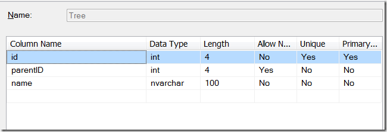
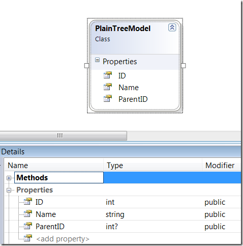
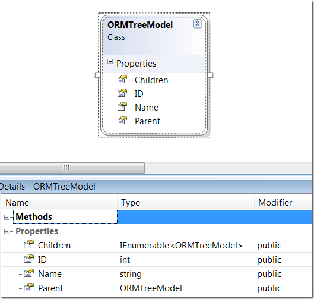
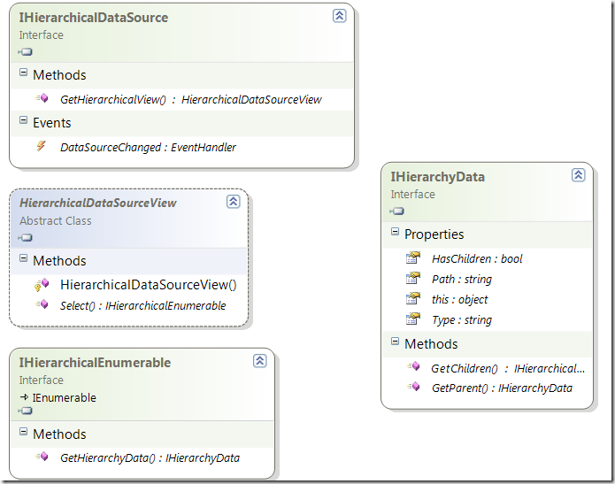
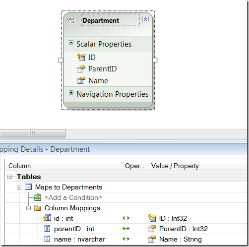
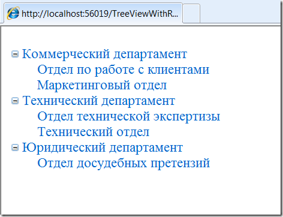

Реализация обобщённого варианта IHierarchicalDataSource
=======================================================

    published: 2009-09-13 
    tags: advanced,asp.net 
    permalink: https://andir-notes.blogspot.com/2009/09/ihierarchicaldatasource-generic.html

Задача отображения иерархических данных достаточно часто встречается в практике. Это и файловая структура (папка->папка->…->файл), и  организационная структура компании (департамент->отдел->группа), и иерархия подчинения сотрудников (директор->менеджер->рядовой сотрудник), и проектная деятельность (группа проектов->проект->подсистема->задача).

В стандартной поставке ASP.Net есть два основных контрола, которые поддерживают отображение иерархических данных: **asp:TreeView** и **asp:Menu**. Кроме того, они также поддерживают биндинг с иерархическим источником данных, т.е. с таким источником, который реализует интерфейс **IHierarchicalDataSource**.

Источников, которые реализуют интерфейс **IHierarchicalDataSource**, существует всего два, это: **XmlDataSource** и **SiteMapDataSource**. Кроме того, эти источники одновременно являются декларативными элементами UI, которые можно использовать в разметке.

Например:

**XmlDataSource.aspx**

``` xml
<%@ Page 
    Language="C#"
    MasterPageFile="~/Shared/Site.Master"
    AutoEventWireup="true" %>
<asp:Content ContentPlaceHolderID="BodyPlaceHolder" runat="server">
    <asp:TreeView ID="treeView" runat="server"
        DataSourceID="xmlDataSource">
        <DataBindings>
            <asp:TreeNodeBinding 
                DataMember="Root" 
                Text="Root"
                />
            <asp:TreeNodeBinding 
                DataMember="Node" 
                TextField="Name" />
        </DataBindings>
    </asp:TreeView>
    <asp:XmlDataSource ID="xmlDataSource" runat="server">
        <Data>
            <Root>
                <Node Name="Node 1" />
                <Node Name="Node 2">
                    <Node Name="Node 2.1" />
                    <Node Name="Node 2.2" />
                </Node>
                <Node Name="Node 1" />
            </Root>
        </Data>
    </asp:XmlDataSource>
</asp:Content>
```

_Примечание: Более подробный пример использования биндинга asp:TreeView к XmlDataSource можно посмотреть в следующей [заметке](http://andir-notes.blogspot.com/2009/09/asptreeview-decrarative-binding.html)._

А что, если требуется отобразить данные полученные из базы данных? Для этого придётся самостоятельно реализовывать указанный интерфейс **IHierarchicalDataSource**.

#### Модель

Рассмотрим типичную модель древовидных данных хранимых в БД:

 

Как видно на скриншоте, модель представляет собой таблицу со следующими полями: ID – уникальный идентификатор записи, ParentID – ключ для связи с родительской записью или NULL – если запись является корневой.

После извлечения данных, древовидные данные отображаются на конкретную модель. Рассмотрим две наиболее часто используемых модели.

Первая – это прямолинейная проекция структуры БД на объект:

 

Второй вариант обычно возникает при использовании продвинутых средств отображения (ORM):



В данном случае, видим что вместо одного поля **ParentID** создано два дополнительных поля: **Parent** и **Children**. **Parent** – это ссылка на родительский элемент **ORMTreeModel**, а **Children** – перебираемая последовательность дочерних объектов **ORMTreeModel**.

Представим себе, что нам требуется отобразить данные смоделированные подобным образом в контроле asp:TreeView. Для этого потребуется реализовать интерфейс **IHierarchicalDataSource.**

#### Реализация интерфейса IHierarchicalDataSource

Любая реализация **IHierarchicalDataSource** напрямую связана с реализацией абстрактного класса **HierarchicalDataSourceView** и интерфейсов **IHierarchicalEnumerable** и **IHierarchyData**.

Вот как это выглядит в виде диаграммы классов:



Центральным звеном реализации является IHierarchyData, который и абстрагирует модель древовидных данных.

_Примечание: На скриншоте есть одна известная ошибка диаграммы классов генерируемой Visual Studio. Дизайнер диаграмм показывает поля с именем Item переименованными в this. Что хорошо видно в интерфейсе IHierarchyData. В данном случае, это конечно же неверно._

_Примечание: Также обратите внимание, что интерфейс IHierarchyData во многом повторяет класс ORMTreeModel приведённый выше._

Теперь определимся с задачей, которую нам предстоит решить. Нужно получать древовидные данные из внешнего источника данных и преобразовывать их к иерархическому источнику данных. Желательно абстрагироваться от конкретного источника и конкретного вида модели данных.

#### Типизированные обёртки для базовых интерфейсов

Для начала, сделаем некоторые приготовления и реализуем типизированные версии интерфейсов **IHierarchyData** и **IHierarchyEnumerable**:

**HierarchyData.cs**

``` cs
using System.Web.UI;

namespace Home.Andir.Examples
{
    public abstract class HierarchyData<T> : IHierarchyData
    {
        public abstract HierarchyData<T> GetParent();
        public abstract HierarchicalEnumerable<T> GetChildren();
        public abstract T Item { get; }

        #region IHierarchyData Members

        IHierarchyData IHierarchyData.GetParent()
        {
            return GetParent();
        }

        public abstract bool HasChildren { get; }

        IHierarchicalEnumerable IHierarchyData.GetChildren()
        {
            return GetChildren();
        }

        object IHierarchyData.Item
        {
            get { return Item; }
        }

        public abstract string Path { get; }

        public abstract string Type { get; }

        #endregion
    }
}
```

**HierarchyEnumerable.cs**

``` cs
using System.Collections;
using System.Web.UI;

namespace Home.Andir.Examples
{
    public abstract class HierarchicalEnumerable<T> 
        : IHierarchicalEnumerable
    {
        public abstract HierarchyData<T> GetHierarchyData(
            T enumeratedItem);

        #region IHierarchicalEnumerable Members

        IHierarchyData IHierarchicalEnumerable.GetHierarchyData(
            object enumeratedItem)
        {
            return GetHierarchyData((T)enumeratedItem);
        }

        #endregion

        #region IEnumerable Members

        public abstract IEnumerator GetEnumerator();

        #endregion
    }
}
```

Всё максимально прямолинейно, просто прячем нетипизированные версии за явной реализацией интерфейса, а наружу выставляем только типизированные версии этих же методов и свойств.

#### Репозиторий

Определим интерфейс для обобщённого хранилища объектов, из которого мы будем получать данные для иерархического обхода:

**IHierarchyDataRepository.cs**
``` cs
using System.Collections.Generic;

namespace Home.Andir.Examples
{
    public interface IHierarchyDataRepository<T> 
        where T : class
    {
        T GetParent(T item);
        IEnumerable<T> GetChildren(T item);
        string GetItemType(T item);

        T GetItem(string hierarchyPath);
        string GetItemHierarchyPath(
            string parentHierarchyPath, T item);
    }
}
```

Для чего нужен этот интерфейс? Он предназначен для абстрагирования от конкретных источников иерархических данных и его реализации должны быть привязаны к некоторому внешнему источнику.

_Примечание: Необходимо обратить внимание, что в данном варианте интерфейса и дальнейшей реализации используется неявное предположение для метода GetChildren: если передан параметр со значением **null**, то реализация должна вернуть список корневых элементов дерева. Вообще, это не очень хорошее решение, и, с точки зрения архитектуры, гораздо лучше иметь отдельный метод для получения корневых элементов дерева._

Реализацию репозитория пока отложим и реализуем необходимые интерфейсы для **IHierarchicalDataSource** предполагая, что данные поступают к нам из некоторого репозитория **IHierarchyDataRepository**.

**GenericHierarchicalDataSource.cs**

``` cs
using System;
using System.Web.UI;

namespace Home.Andir.Examples
{
    public sealed class GenericHierarchicalDataSource<T>
        : IHierarchicalDataSource 
        where T : class
    {
        readonly IHierarchyDataRepository<T> repository;

        public GenericHierarchicalDataSource(
            IHierarchyDataRepository<T> repository)
        {
            this.repository = repository;
        }

        #region IHierarchicalDataSource Members

        public event EventHandler DataSourceChanged;

        public HierarchicalDataSourceView GetHierarchicalView(
            string viewPath)
        {
            return new GenericHierarchicalDataSourceView<T>(
                repository, viewPath);
        }

        #endregion
    }
}
```

Итак, сам **IHierarchicalDataSource** довольно примитивен: принимает в качестве параметров репозиторий и передаёт его дальше – реализации абстрактного **HierarchicalDataSourceView**.

**GenericHierarchicalDataSourceView.cs**

``` cs
using System.Web.UI;

namespace Home.Andir.Examples
{
    public sealed class GenericHierarchicalDataSourceView<T> 
        : HierarchicalDataSourceView 
        where T : class
    {
        readonly IHierarchyDataRepository<T> repository;
        readonly string viewPath;

        public GenericHierarchicalDataSourceView(
            IHierarchyDataRepository<T> repository, string viewPath)
        {
            this.repository = repository;
            this.viewPath = viewPath;
        }

        public override IHierarchicalEnumerable Select()
        {
            if (!string.IsNullOrEmpty(viewPath))
            {
                var hierarchyItem = new GenericHierarchyData<T>(
                    repository, viewPath);
                return hierarchyItem.GetChildren();
            }

            return new GenericHierarchicalEnumerable<T>(
                repository, null, repository.GetChildren(null));
        }
    }
}
```

Здесь нужно обратить внимание на параметр конструктора **viewPath**, который представляет собой начальный путь обхода иерархического источника данных.

В остальном реализация **GenericDataSourceView** также не представляет интереса, всё передаётся на откуп двум оставшимся интерфейсам.

**GenericHierarchicalEnumerable.cs**

``` cs
using System.Collections;
using System.Collections.Generic;

namespace Home.Andir.Examples
{
    public sealed class GenericHierarchicalEnumerable<T>
        : HierarchicalEnumerable<T> 
        where T : class
    {
        readonly IHierarchyDataRepository<T> repository;
        readonly HierarchyData<T> parent;
        readonly IEnumerable<T> enumerableList;

        public GenericHierarchicalEnumerable(
            IHierarchyDataRepository<T> repository,
            HierarchyData<T> parent,
            IEnumerable<T> enumerableList
            )
        {
            this.repository = repository;
            this.parent = parent;
            this.enumerableList = enumerableList;
        }

        #region IHierarchicalEnumerable Members

        public override HierarchyData<T> GetHierarchyData(T item)
        {
            return new GenericHierarchyData<T>(
                repository, parent, item);
        }

        #endregion

        #region IEnumerable Members

        public override IEnumerator GetEnumerator()
        {
            return enumerableList.GetEnumerator();
        }

        #endregion
    }
}
```

Этот интерфейс представляет собой расширение абстракции IEnumerable – перечислимых данных – до абстракции перечисление дерева с возможностью продвижения от некоторого корневого элемента дерева до его листьев.

**IHierarchicalEnumerable** отличается от обычного **IEnumerable** только дополнительным методом _GetHierarchyData_, который предназначен для конвертации перебираемых элементов в реализацию иерархической модели **HierarchyData**.

**GenericHierarchyData.cs**

``` cs
using System.Collections.Generic;
using System.Linq;

namespace Home.Andir.Examples
{
    public sealed class GenericHierarchyData<T> 
        : HierarchyData<T> 
        where T : class
    {
        readonly IHierarchyDataRepository<T> repository;
        readonly T item;
        readonly HierarchyData<T> parent;
        readonly IList<T> children;
        readonly string path;
        readonly string type;

        public GenericHierarchyData(
            IHierarchyDataRepository<T> repository,
            string itemPath)
        {
            this.repository = repository;
            this.item = repository.GetItem(itemPath);
            this.parent = null;
            this.children = repository.GetChildren(item).ToList();
            this.path = itemPath;
            this.type = repository.GetItemType(item);
        }

        public GenericHierarchyData(
            IHierarchyDataRepository<T> repository,
            HierarchyData<T> parent,
            T item
            )
        {
            this.repository = repository;
            this.item = item;
            this.parent = parent;
            this.children = repository.GetChildren(item).ToList();
            this.path = repository.GetItemHierarchyPath(
                parent == null ? "" : parent.Path, item);
            this.type = repository.GetItemType(item);
        }

        #region IHierarchyData Members

        public override HierarchyData<T> GetParent()
        {
            return parent;
        }

        public override bool HasChildren
        {
            get { return children.Count > 0; }
        }

        public override HierarchicalEnumerable<T> GetChildren()
        {
            return new GenericHierarchicalEnumerable<T>(
                repository, this, children
                );
        }

        public override T Item { get { return item; } }

        public override string Path { get { return path; } }

        public override string Type { get { return type; } }

        #endregion
    }
}
```

В реализации **IHierarchyData** фактически выполняется конечное извлечение данных из нашей абстракции репозитория иерархических данных.

Используется два конструктора: первый предназначен для создания объекта от некоторого начального пути **itemPath** в дереве, второй создаёт текущий объект обхода.

А теперь самое интересное, необходимо реализовать некоторый конечный репозиторий иерархических данных.

#### Реализация IHierarchyDataRepository

Так как настоящий слой данных обычно реализуется независимо от тех всяческих UI-биндингов, то мы будем представлять что где-то в слое данных уже есть реализованный набор операций доступа к хранилищу объектов.

Вспоминаем наши первоначальные модели древовидных данных **PlainTreeModel** и **ORMTreeModel**.

Для первой модели, интерфейс должен выглядеть примерно так:

**IPlaneTreeModelRepository.cs**

``` cs
using System.Collections.Generic;

namespace Home.Andir.Examples
{
    public interface IPlainTreeModelRepository<T>
    {
        IEnumerable<T> GetRoots();
        IEnumerable<T> GetItems(int parentID);
        T GetItem(int id);
    }
}
```

Но в этом примере я не буду использовать интерфейсы, а лучше воспользуюсь возможностями языка C# и представлю данный интерфейс в виде набора независимых функций высшего порядка.

_Примечание: В качестве основных полей объекта предполагается существование полей "ID" и "ParentID", если их в объекте не окажется, то возникнет ошибка времени выполнения._

**PlainTreeModelRepository.cs**

``` cs
using System;
using System.Collections.Generic;

namespace Home.Andir.Examples
{
    public class PlainTreeModelRepository<T>
        : IHierarchyDataRepository<T> 
        where T : class
    {
        readonly Func<IEnumerable<T>> getRootsImpl;
        readonly Func<int, IEnumerable<T>> getItemsById;
        readonly Func<int, T> getItemByIdImpl;

        public PlainTreeModelRepository(
            IPlainTreeModelRepository<T> repository)
            :this(repository.GetRoots, repository.GetItems, repository.GetItem)
        { }

        public PlainTreeModelRepository(
            Func<IEnumerable<T>> getRootsImpl,
            Func<int, IEnumerable<T>> getItemsById,
            Func<int, T> getItemByIdImpl)
        {
            this.getRootsImpl = getRootsImpl;
            this.getItemsById = getItemsById;
            this.getItemByIdImpl = getItemByIdImpl;
        }

        public T GetItem(string path)
        {
            var pathItems = path.Split('/');
            if (pathItems.Length > 0)
            {
                int itemID = int.Parse(
                    pathItems[pathItems.Length - 1]);
                return getItemByIdImpl(itemID);
            }

            return null;
        }

        public IEnumerable<T> GetChildren(T item)
        {
            if (item == null)
                return getRootsImpl();

            return getItemsById(
                item.GetProperty<int>("ID")
                );
        }

        public T GetParent(T item)
        {
            if (item == null)
                throw new ArgumentNullException("item");

            var parentID = item.GetProperty<int>("ParentID");

            return getItemByIdImpl(parentID);
        }

        public string GetItemHierarchyPath(
            string parentHierarchyPath, T item)
        {
            if (parentHierarchyPath == null)
                throw new ArgumentNullException("parentHierarchyPath");
            if (item == null)
                throw new ArgumentNullException("item");

            return string.Format("{0}/{1}",
                parentHierarchyPath,
                item.GetProperty<int>("ID"));
        }

        public string GetItemType(T item)
        {
            if (item == null)
                throw new ArgumentNullException("item");

            return typeof(T).ToString();
        }
    }
}
```

Для составления пути внутри иерархической структуры используется нотация в виде /RootID/…/ParentID/ItemID/ChildID. В качестве типа объектов используется CLR-тип этого объекта.

Поля объектов извлекаются с помощью рефлексии (точнее TypeDescriptor'а) и следующего хелпера:

**TypeDescriptorExtensions.cs**

``` cs
using System;
using System.ComponentModel;

namespace Home.Andir.Examples
{
    public static class TypeDescriptorExtensions
    {
        public static TResult GetProperty<TResult>(
            this object item,
            string propName)
        {
            var properties = TypeDescriptor.GetProperties(item);
            var descriptor = properties.Find(propName, true);
            if (descriptor != null
                && descriptor.PropertyType == typeof(TResult))
            {
                return (TResult)descriptor.GetValue(item);
            }
            else
            {
                throw new InvalidOperationException(
                    String.Format("Property '{0}' with type '{1}' not found.", 
                        propName, typeof(TResult)));
            }
        }
    }
}
```

Аналогичным образом реализуем модель характерную для ORM.

Интерфейс хранилища объектов, который нам понадобится будет выглядеть так:

``` cs
using System.Collections.Generic;

namespace Home.Andir.Examples
{
    public interface IORMTreeModelRepository<T>
    {
        IEnumerable<T> GetRoots();
        T GetItem(int parentID);
    }
}
```

Но опять же, использовать данный интерфейс мы не станем, а обойдёмся фукнциями высшего порядка в параметрах конструктора.

Путь в иерархической структуре строится аналогично предыдущей модели.

_Примечание: В качестве основных полей объекта предполагается существование полей "ID", "Parent" и "Children", если их в объекте не окажется, то возникнет ошибка времени выполнения._

**ORMTreeModelRepository.cs**

``` cs
using System;
using System.Collections.Generic;

namespace Home.Andir.Examples
{
    public class ORMTreeModelRepository<T>
        : IHierarchyDataRepository<T> 
        where T : class
    {
        readonly Func<IEnumerable<T>> getRootsImpl;
        readonly Func<int, T> getItemByIdImpl;

        public ORMTreeModelRepository(
            IORMTreeModelRepository<T> repository)
            : this(repository.GetRoots, repository.GetItem)
        { }

        public ORMTreeModelRepository(
            Func<IEnumerable<T>> getRootsImpl,
            Func<int, T> getItemImpl)
        {
            this.getRootsImpl = getRootsImpl;
            this.getItemByIdImpl = getItemImpl;
        }

        public T GetItem(string path)
        {
            var pathItems = path.Split('/');
            if (pathItems.Length > 0)
            {
                int itemID = int.Parse(
                    pathItems[pathItems.Length - 1]);
                return getItemByIdImpl(itemID);
            }

            return null;
        }

        public IEnumerable<T> GetChildren(T item)
        {
            if (item == null)
                return getRootsImpl();

            return item.GetProperty<IEnumerable<T>>("Children");
        }

        public T GetParent(T item)
        {
            if (item == null)
                throw new ArgumentNullException("item");

            return item.GetProperty<T>("Parent");
        }

        public string GetItemHierarchyPath(
            string parentHierarchyPath, T item)
        {
            if (parentHierarchyPath == null)
                throw new ArgumentNullException("parentHierarchyPath");

            if (item == null)
                throw new ArgumentNullException("item");

            return string.Format("{0}/{1}",
                parentHierarchyPath,
                item.GetProperty<int>("ID"));
        }

        public string GetItemType(T item)
        {
            if (item == null)
                throw new ArgumentNullException("item");

            return typeof(T).ToString();
        }
    }
}
```

Для более типизированного использования потребуется реализовать интерфейс иерархического репозитория для конкретного типа или ввести интерфейс, который должны будут поддерживать объекты из иерархического хранилища.

#### Пример использования

Предположим, что у нас есть база данных, которая содержит в себе иерархическую структуру отделов некоторой организации.

Для доступа к этой БД будем использовать Entity Framework, модель будет выглядеть следующим образом:



Реализуем слой данных для доступа к данным в этой таблице:

``` cs
using System.Collections.Generic;
using System.Linq;

namespace Home.Andir.Examples.Code.DataLayer
{
    public class DepartmentRepository
    {
        public IEnumerable<Department> GetDepartments()
        {
            using (var context = new HierarchicalDbEntities())
            {
                var query = from d in context.DepartmentSet
                            where !d.ParentID.HasValue
                            select d;

                return query.ToList();
            }
        }

        public IEnumerable<Department> GetDepartments(int parentID)
        {
            using (var context = new HierarchicalDbEntities())
            {
                var query = from d in context.DepartmentSet
                            where d.ParentID.HasValue 
                                && d.ParentID.Value == parentID
                            select d;

                return query.ToList();
            }
        }

        public Department GetDepartment(int id)
        {
            using (var context = new HierarchicalDbEntities())
            {
                var query = from d in context.DepartmentSet
                            where d.ID == id
                            select d;

                return query.First();
            }
        }
    }
}
```

Сделаем страничку, на которой будем отображать организационную структуру:

``` xml
<%@ Page
    Language="C#" 
    MasterPageFile="~/Shared/Site.Master"
    AutoEventWireup="true"
    CodeBehind="TreeViewWithRepository.aspx.cs"
    Inherits="Home.Andir.Examples.TreeViewWithRepositoryPage" %>
<asp:Content ContentPlaceHolderID="BodyPlaceHolder" runat="server">
    <asp:TreeView ID="treeView" runat="server">
        <DataBindings>
            <asp:TreeNodeBinding ValueField="ID" TextField="Name" />
        </DataBindings>
    </asp:TreeView>
</asp:Content>
```

и теперь в CodeBehind реализуем биндинг данных к **DepartmentRepository**:

``` cs
using System;

using Home.Andir.Examples.Code.DataLayer;

namespace Home.Andir.Examples
{
    public partial class TreeViewWithRepositoryPage 
        : System.Web.UI.Page
    {
        protected void Page_Load(object sender, EventArgs e)
        {
            var repository = new DepartmentRepository();

            treeView.DataSource =
                new GenericHierarchicalDataSource<Department>(
                    new PlainTreeModelRepository<Department>(
                        () => repository.GetDepartments(),
                        item => repository.GetDepartments(item.ID),
                        id => repository.GetDepartment(id)));
            treeView.DataBind();
        }
    }
}
```

Для проверки запускаем:



Вот, наконец-то, всё заработало :-)

Полный проект с реализацией IHierarchicalDataSource можно взять [здесь](HierarchicalDataSource.zip).