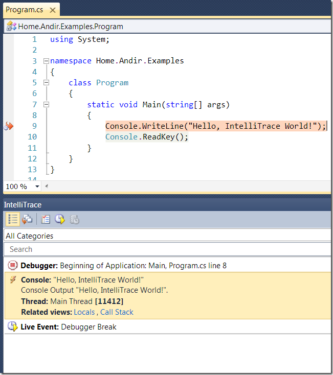

IntelliTrace – новый инструмент для отладки в Visual Studio 2010
================================================================

    published: 2010-02-10 
    tags: .net,debug,tools,visual studio 
    permalink: https://andir-notes.blogspot.com/2010/02/intellitrace-new-tool-for-debugging-in.html

Совсем недавно [вышел](http://msdn.microsoft.com/en-us/vstudio/dd582936.aspx) Release Candidate для Visual Studio 2010. Новая студия стала гораздо стабильнее и быстрее, так что пора уже обращать внимание на её новые возможности, а не только на свеженький WPF-интерфейс.

Около полугода назад я [упоминал](http://andir-notes.blogspot.com/2009/08/visual-studio-2010-historical-debugger.html) про новую штуку, которую можно найти в Visual Studio 2010: Historical Debugger. Это имя оказалось внутренним, в релиз-кандидате эта возможность называется уже по-другому: IntelliTrace. По-русски это должно звучать, примерно как, “Умный следопыт”.

Посмотрим на него (на следопыта) вживую!

#### Введение

Отладка в современных условиях обычно выполняется одним из следующих методов:

*   Printf-like отладка,

> вывод информации во время исполнения программы во внешний поток: консоль, файл и т.п.,

*   Использование интегрированного отладчика,

> пошаговое выполнение программы под строгим наблюдением с инструментами установки контрольных точек и просмотром значений в переменных, регистрах и т.д.,

IntelliTrace это логичное продолжение и совмещение двух этих методов. Записываем всю нужную информацию во время работы приложения и затем можем в любой момент пронаблюдать состояние программы в каждой из записанных точек.

Понятно, что совсем всю информацию о выполнении приложения записать не получится – это и существенное замедление работы программы и огромный объём данных, поэтому записывается лишь определённый расширяемый набор событий, которые представляются важными для приложения.

Новый инструмент, несомненно, представляет собой следующий этап развития средств отладки в интегрированных средах разработки.

#### Из огня да в полымя

Начнём с наскоку методом интуитивного изучения. Запускаем Visual Studio 2010 RC и создаём простое консольное приложение. Код минимальный, только для демонстрации.

``` cs
using System;

namespace Home.Andir.Examples
{
    class Program
    {
        static void Main(string\[\] args)
        {
            Console.WriteLine("Hello, IntelliTrace World!");
            Console.ReadKey();
        }
    }
}
```

Запускаем. На консоль будет выведено сообщение и программа начнёт ждать нажатия клавиши (_Console.ReadKey_). Этого вполне достаточно.

Открываем окно “IntelliTrace”, если его ещё не видно: _Debug_ –> _Windows_ –> _IntelliTrace Calls_.

 [](Intellitrace_Calls[6].png)

Всё что нужно далее для активации инструмента написано прямо в этом окне.

Нажимаем кнопку и программа останавливается. Теперь можно увидеть лог событий, которые были записаны IntelliTrace’ом.

 


В списке событий появилось два события: **Beginning of Application** и **Debugger Break**. Ничего примечательного, но для начала сойдёт.

Если выбрать любое событие, то точка останова в программе перемещается на место, где это событие произошло и в окне можно просмотреть подробную информацию о событии.

 [](IntelliTraceLogSelectedEvent[4].png)

#### Настройки

Для настройки работы IntelliTrace появился целый узел в дереве Options:

 

IntelliTrace может работать в двух режимах: _IntelliTrace events only_ и _IntelliTrace events and call information_, которые определяют уровень и количество записываемой информации. Оба режима настраиваются и позволяют определять какие именно события записывать, а какие игнорировать.

Если перейти на подузел настроек _IntelliTrace Events_, то можно увидеть тот самый список значимых событий, который подготовили в Microsoft:

 

О! Это уже что-то, давайте добавим к нашему первому примеру запись всех событий Console. Отмечаем галочкой группу Console и запускаем:

 

Теперь событий стало три. IntelliTrace залогировал событие вывода на консоль и мы можем легко перейти в это место и посмотреть состояние программы в этот момент.

Теперь пора перейти к более сложному примеру.

#### Пример использования с ASP.Net MVC

Для большего понимания работы инструмента, продемонстрирую запуск IntelliTrace в случае приложения на базе фреймворка ASP.Net MVC 2.

Создаём проект IntelliTrace.AspNetMvc в студии с помощью стандартного шаблона. Настраиваем IntelliTrace на логирование всех событий и информации о вызовах методов. И запускаем. Придётся подождать.

 

После этого жмём на Break All в инструменте IntelliTrace и смотрим на список залогированных событий:

 

В этот список попали два вида событий: Исключения (брошенные и пойманные) и события ASP.Net (HTTP-запрос и сохранение состояния).

Так как мы включили логирование ещё и всех вызовов, то сверху окна IntelliTrace появилась возможность переключится на Calls View – список вызовов.

 

В этом окне пока ничего интересного не видно.

Рассмотрим одно из залогированных событий. Пусть это будет событие ASP.Net: GET ‘/’.

 

При выборе этого события становится видна дополнительная информация о событии и набор ссылок, которые указывают на связанную с этим событием информацию: залогированные вызовы методов (Calls View), локальные данные (Locals) и стэк вызовов (Call Stack):

**IntelliTrace Calls View:**

 

Вот теперь в окне Calls View теперь стало гораздо больше информации: появился контекст события: стало видно какие из записанных событий IntelliTrace предшествовали данному, какие происходили после. В данном окне можно перемещаться по событиям и просматривать связанную с ними информацию.

**IntelliTrace Locals:**

 [](AspNetMvcIntelliTraceLocalsForGet[4].png)

В окне Locals отображается та информация, которая существенна для данного события: HTTP-метод, который использовался для доступа и Url. Набор этой информации весьма ограничен и определяется настройками этого типа событий IntelliTrace.

**IntelliTrace Stack Trace:**

 

Собственно снимок стэка исполнения в данной точке, хорошо известный всем разработчикам под .Net, кто хотя бы раз сталкивался с отладкой своего приложения.

_Примечание: Но, честно говоря, информации о конкретном событии в заданной точке IntelliTrace залогировано достаточно мало. Хотелось бы видеть немного больше информации: например состояние HttpContext для данного вызова, данные Htpp-запроса и т.п._

#### Технические детали

IntelliTrace как и Code Contracts во время своей работы инжектит специальные методы в результирующую сборку (Post Build IL Rewriting).

_Примечание: Кодовое имя IntelliTrace, которое довольно часто встречается в реестре и файлах VS 2010: Proteus._

Фактически сам IntelliTrace реализован как отдельный процесс, который запускается отдельно с помощью консольной программы 
_%ProgramFiles%\\Microsoft Visual Studio 10.0\\Team Tools\\TraceDebugger Tools\\IntelliTrace.exe_. Поэтому во время любого сеанса IntelliTrace этот процесс можно обнаружить у себя в диспетчере задач.

Запускается он обычно где-то так:
```
"C:\\Program Files\\Micrsoft Visual Studio 10.0\\Team Tools\\TraceDebugger Tools\\IntelliTrace.EXE" 
    run 
    /n:"intellitrace.console.vshost.exe\_00000ba0\_01cab4109a27f296" 
    /cp:"C:\\Users\\Andir\\AppData\\Local\\Microsoft\\VisualStudio\\10.0\\TraceDebugger\\Settings\\zrnoutrh.ozc" 
    /f:"IntelliTrace.Console.vshost\_00000ba0\_100223\_014433.iTrace"
```

Параметры: /n – это имя логгера, /cp – это путь до файла с настройками, /f – имя файла, в который будет складываться информация.

Вся информация, которая сохраняется во время сеанса IntelliTrace исполнения программы пишется в специальный файл бинарного формата, который находится в папке _%ProgramData%\\Microsoft Visual Studio\\10.0\\TraceDebugging\\_ и имеет расширение \*.iTrace. Visual Studio во время сеанса отладки с использованием IntelliTrace загружает этот файл и использует для навигации по точкам исполнения и загрузки информации записанной в этих точках.

Настройки по умолчанию IntelliTrace находятся в файле: _%ProgramFiles%\\Microsoft Visual Studio 10.0\\Team Tools\\TraceDebugger Tools\\en\\CollectionPlan.xml_. К сожалению, Visual Studio напрямую не использует этот файл для настройки IntelliTrace. Перед запуском IntelliTrace.exe студия копирует (сериализует) собственные настройки IntelliTrace в отдельный файл в папке: _%LocalAppData%\\Microsoft\\VisualStudio\\10.0\\TraceDebugger\\Settings\\_.

Взглянем на файл c настройками поподробнее:

 

Ничего специфического в этом файле на первый взгляд не видно: здесь просто собраны все те настройки, что видно в диалоге Options –> IntelliTrace и в студии. Но давайте приглядимся к одной немаловажной детали: TracePointProvider и DiagnosticEventSpecification.

Из их названий, собственно, уже понятно, что так скомпонованы провайдер точек, которые будет записывать IntelliTrace. А DiagnosticEventSpecification – определяет спецификацию одной из таких точек. Рассмотрим спецификацию события Console.WriteLine:

``` xml
<DiagnosticEventSpecification enabled="false">
    <CategoryId>console</CategoryId>
    <SettingsName _locID="settingsName.Console.WriteLine.Object">WriteLine (Object)</SettingsName>
    <SettingsDescription _locID="settingsDescription.Console.WriteLine.Object">Console Output with an Object passed in.</SettingsDescription>
    <Bindings>
        <Binding>
            <ModuleSpecificationId>mscorlib</ModuleSpecificationId>
            <TypeName>System.Console</TypeName>
            <MethodName>WriteLine</MethodName>
            <MethodId>System.Console.WriteLine(System.Object):System.Void</MethodId>
            <ProgrammableDataQuery>
                <ModuleName>Microsoft.VisualStudio.DefaultDataQueries.dll</ModuleName>
                <TypeName>Microsoft.VisualStudio.DataQueries.Console.Output.WriteLineDataQuery</TypeName>
            </ProgrammableDataQuery>
        </Binding>
    </Bindings>
</DiagnosticEventSpecification>

```

Итак, первое что мы видим - это набор настроек точки: категория, название, описание. Второе – это некоторые _Bindings_, которые очевидно и связывают точку и те данные, которые записываются в этой точке.

Для события Console.WriteLine существует всего один биндинг, который определяет метод System.Console.WriteLine с двумя аргументами. ModuleSpecificationId – это сборка, в которой находится искомый метод, TypeName – имя типа, MethodName – имя метода и MethodId – это искомая перегрузка данного метода.

И последнее что мы видим – это некоторый ProgrammableDataQuery – который по сути является основой для IntelliTrace в получении информации о событии в точке записи.

Воспользовавшись рефлектором можно обнаружить, что ProgrammableDataQuery – это управляемый класс (в вышеприведённом примере это Microsoft.VisualStudio.DataQueries.Console.Output.WriteLineDataQuery), который отнаследован от интерфейса IProgrammableDataQuery:

``` cs
public interface IProgrammableDataQuery
{
    // Methods
    object[] EntryQuery(object thisArg, object[] args);
    object[] ExitQuery(object returnValue);
    List<CollectedValueTuple> FormatCollectedValues(object[] results);
    string FormatLongDescription(object[] results);
    string FormatShortDescription(object[] results);
    List<Location> GetAlternateLocations(object[] results);
}
```

Гораздо чаще, чем ProgrammableDataQuery, в CollectionPlan.xml используется DataQuery. Судя по всему – это стандартная реализация, которая автоматически получает данные от текущего класса (очень похоже на Reflection). В параметрах задаётся путь к определённой внутренней переменной класса:

``` xml
<DiagnosticEventSpecification>
    <CategoryId>system.data</CategoryId>
    <SettingsName _locID="settingsName.OdbcCommand.ExecuteReader">ExecuteReader (ODBCCommand)</SettingsName>
    <SettingsDescription _locID="settingsDescription.OdbcCommand.ExecuteReader">Command text was executed, building an OdbcDataReader using one of the CommandBehavior values. (just test)</SettingsDescription>
    <Bindings>
        <Binding>
            <ModuleSpecificationId>system.data</ModuleSpecificationId>
            <TypeName>System.Data.Odbc.OdbcCommand</TypeName>
            <MethodName>ExecuteReader</MethodName>
            <MethodId>System.Data.Odbc.OdbcCommand.ExecuteReader(System.Data.CommandBehavior):System.Data.Odbc.OdbcDataReader</MethodId>
            <ShortDescription _locID="shortDescription.OdbcCommand.ExecuteReader">Execute Reader "{0}"</ShortDescription>
            <LongDescription _locID="longDescription.OdbcCommand.ExecuteReader">The command text "{0}" was executed on connection "{1}", building an OdbcDataReader using one of the CommandBehavior values.</LongDescription>
            <DataQueries>
                <DataQuery index="0" maxSize="4096" type="String" name="Command Text" _locID="dataquery.OdbcCommand.ExecuteReader.CommandText" _locAttrData="name" query="_commandText"></DataQuery>
                <DataQuery index="0" maxSize="256" type="String" name="Connection String" _locID="dataquery.OdbcCommand.ExecuteReader.ConnectionString" _locAttrData="name" query="_connection._userConnectionOptions._usersConnectionString"></DataQuery>
            </DataQueries>
        </Binding>
    </Bindings>
</DiagnosticEventSpecification>
```

Как видно, в данном случае, с помощью запросов получают из параметра с индексом 0 (это this) строку соединения (Connection String) и команду SQL (Command Text).

Судя по файлу CollectionPlan.xml, механизм IntelliTrace представляет собой хорошо расширяемую платформу. Но пока Visual Studio не предоставляет никаких механизмов для добавления, например, своих событий для записи. Единственное, что возможно – это создавать свои собственные iTrace файлы для определённой конфигурации CollectionPlan. Полагаю, что это задел на будущее для каких-то новых инструментов, например Code Coverage.

#### Заключение

Описанный новый инструментарий для разработчика в такой консервативной области как отладка приложений выглядит очень многообещающе. Предполагаю, что скорее всего логирование IntelliTrace в релизе будет включено по умолчанию и позволит разработчикам видеть все ключевые точки работы приложения прямо во время разработки.

Ещё более многообещающей выглядит область будущих применений \*.iTrace файлов. Собранная информация позволит анализировать работу приложений как в ручном, так и в автоматическом режиме. Это поможет выявлять ошибки, собирать статистику о работе приложения, реализовывать автоматические функциональные тесты основанные на точках, которые должно пройти приложение и т.п.

#### Литература для дальнейшего изучения

*   MSDN, [Debugging With IntelliTrace](http://msdn.microsoft.com/en-us/library/dd264915%28VS.100%29.aspx),
*   Ian Huf blog: [IntelliTrace Info](http://blogs.msdn.com/ianhu/default.aspx),
*   John Robbins blog\*: [VS 2010 Beta 2 IntelliTrace In-Depth First Look](http://www.wintellect.com/CS/blogs/jrobbins/archive/2009/10/19/vs-2010-beta-2-intellitrace-in-depth-first-look.aspx),
*   John Robbins blog: [How Does VS2010 Historical Debugging Work?](http://www.wintellect.com/CS/blogs/jrobbins/archive/2009/06/16/how-does-vs2010-historical-debugging-work.aspx),
*   Habib Heydarian blog: [Coverage of the Visual Studio 2010 Historical Debugger](http://blogs.msdn.com/habibh/archive/2009/09/21/coverage-of-the-visual-studio-2010-historical-debugger.aspx),
*   Ian Huf blog: [IntelliTrace and CollectionPlan.xml](http://blogs.msdn.com/ianhu/archive/2010/02/10/intellitrace-and-collectionplan-xml.aspx)

\* – John Robbins, Джон Роббинс – автор известной книги “Отладка приложений для Microsoft .NET и Microsoft Windows”.