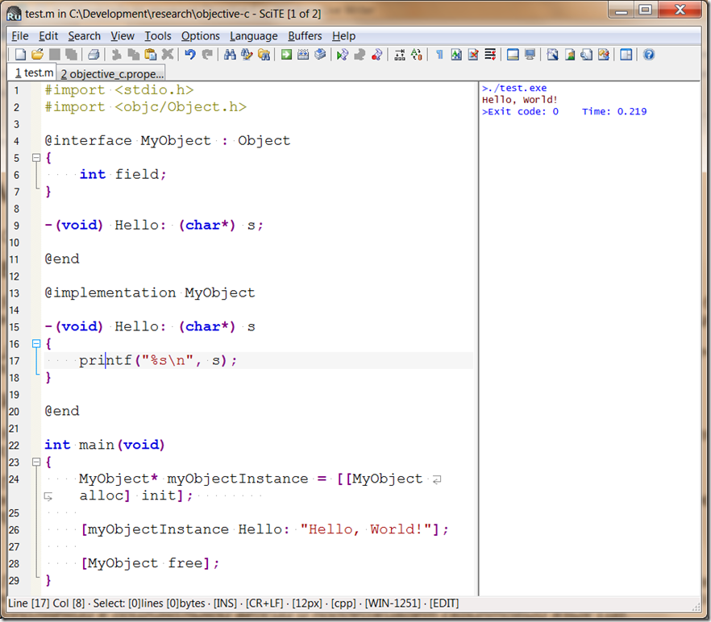

Мини-гайд по началам изучения Objective C
=========================================

	published: 2011-09-13 
	tags: apple,objective-c,beginner,smalltalk 
	permalink: https://andir-notes.blogspot.com/2011/09/objective-c.html

Опять же, собрано для себя.

#### Введение

Язык Objective C, на первый взгляд, очень простой, чтобы начать программировать – достаточно базового знания Cи и слышать что-нибудь про [SmallTalk](http://ru.wikipedia.org/wiki/SmallTalk), где вызов метода – это посылка сообщения.

Для людей с бэкграундом любого обьектно-ориентированного языка все концепции очень быстро понимаются и изучаются методом практического программирования.

#### Инструменты

Как это не странно, но каких-либо удобных инструментов под платформу Windows для этого языка не существует не найдено мной, к сожалению.

Поэтому как обычно, пришлось брать стандартный GCC (с поддержкой Objective C) и MakeFile в руки. Для редактирования текстов и исполнения программ, я уже который год подряд использую прекрасный, хоть уже слегка и устаревший редактор Scite.

[](image%255B3%255D.png)

_Примечание: Официальную версию Scite можно взять_ [_тут_](http://www.scintilla.org/SciTE.html)_. Однако, самой подходящей версией Scite, сейчас, видимо является –_ [_русская сборка_](http://code.google.com/p/scite-ru/)_, которая содержит ряд полезных дополнений к оригинальной версии и поддерживает скриптовый язык Lua._

И далее, компилировать GCC с поддержкой Objective-C:

```
gcc.exe -x objective-c -lobjc -I$(OBJC\_INC) -L$(OBJC\_LIB) \*.m $(OBJC\_BASELIBS) -o Main.exe
```

#### Синтаксис

Ух, это просто сказка.

По сути, вы можете взять любую Си-программу и откомпилировать её компилятором Objective C. Полная обратная совместимость.

А всё дальнейшее – это расширения.

По сути, их несколько: новые ключевые слова, которые начинаются с символа ‘@’ ([коммерческое At](http://ru.wikipedia.org/wiki/@)), посылка сообщения, обрамляемое квадратными скобками, и _всё_. Остальное делает рантайм – то есть библиотеки.

Например:

``` objc
#import <stdio.h>
#import <objc/Object.h>

@interface MyObject : Object
{
    int field;
}

-init;
-(void) Hello: (char*) s;

@end

@implementation MyObject

-init
{
    [super init];

    field = 5;
}

-(void) Hello: (char*) s
{
    printf("%s\n", s);
}

@end

int main(void)
{
    MyObject* myObjectInstance = [[MyObject alloc] init];        
    
    [myObjectInstance Hello: "Hello, World!"];
    
    [myObjectInstance free];
}
```

Разбираем, по очереди.

**#import** – замена стандартного, и набившего всем C++-сникам оскомину, **#include**, – отличие с том, что #import включается ровно один раз при компиляции (да-да, та самая **#pragma once**).

**objc/Object.h** – базовый объект для всех объектов языка Objective-C. Он не является обязательным, но управление памятью реализовано в нём.

**@interface** – первое новое ключевое слово – это объявление нового объекта, содержит во-первых поля объекта (обычная C-структура) и объявления методов объекта в специфическом стиле.

**@implementation –** реализация объявленных в **@interface** методов объекта.

И самое интересное – это посылка сообщений.

**MyObject \*** – указатель на объект.

``` objc
[ObjectInstance Message: Parameter]
```

Итак, это обычные квадратные скобки, которые обозначают посылку сообщения **Message** некоторому объекту **ObjectInstance**. Сообщение может содержать упакованные параметры **Parameter**.

Суть примерно та же, что и в SmallTalk. Объекту можно посылать любые сообщения, обработаны будут только те, которые явно поддерживает объект.

В моём примере, происходит посылка четырёх сообщений:

  1) **\[MyObject alloc\]** – посылка сообщения классу **MyObject** о выделении памяти и создании объекта этого типа.

_Примечание: Да, да, посылка сообщения происходит именно классу объектов. Классы объектов – являются самостоятельными объектами и все создаются во время старта приложения. Соответственно, возможно им посылать сообщения, и доступна интроспекция._

  2) Возвращаемому результату обработки сообщения (это указатель на созданный объект) посылается сообщение **init**, которое в языке Objective C является соглашением об инициализации объекта (конструктор в терминах других языков).

  3) **\[myObjectInstance Hello: "Hello, World!"\]** – посылка сообщения Hello c параметром.

  4) **\[myObjectInstance free\]** – освобождение памяти, ранее выделенной под объект через cообщение **alloc**.

_Примечание: Строго говоря, вызов free – необязательно приводит к освобождению памяти, в связи с тем, что в Objective C для управления памятью используется подсчёт ссылок, а в некоторых случаях и GC._

#### Рантайм

Существует два немного различающихся рантайма: входящий в поставку GCC и от Apple. Отличия у них незначительные. Главное различие – это политика именования заголовочных файлов и классов объектов у Apple: везде добавляется префикс **NS**.

_Примечание: NS – это сокращение от названия [NextStep](http://en.wikipedia.org/wiki/NextStep), историческое название предшественника сегодняшней MAC OS. Набор библиотек для Objective C под Windows доступен в пакете [GNUStep](http://www.gnustep.org/experience/Windows.html)._

Примеры:

GCC: #import <objc/Object.h>

Apple: #import <Foundation/NSObject.h>

Аналогичный эппловскому набор рантайм-библиотек (в пределах небольших изменений) поставляется с библиотеками GNUStep.

#### Литература

*   [lyxite](http://www.blogger.com/profile/17803764860500024863): [Compile Objective-C Programs Using gcc](http://blog.lyxite.com/2008/01/compile-objective-c-programs-using-gcc.html),
*   Apple: [Learning Objective-C: A Primer](http://http://developer.apple.com/library/ios/#referencelibrary/GettingStarted/Learning_Objective-C_A_Primer/_index.html),
*   Wikipedia: [Objective-C](http://ru.wikipedia.org/wiki/Objective_C),
*   [Objective-C Begginer’s Guide](http://www.otierney.net/objective-c.html)